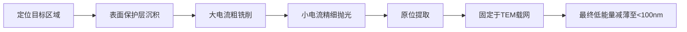

# 第四章：聚焦离子束加工

## 4.1 概述

离子与电子的根本区别在于质量。氢离子的质量是电子的1840倍，而聚焦离子束（Focused Ion Beam, FIB）系统最常用的镓离子则更重。这种巨大的质量差异决定了FIB在纳米加工中的独特地位：离子可以直接溅射材料表面的原子，实现无需光刻胶中间层的材料去除；也可以在前驱气体辅助下沉积材料，实现局部增材加工。电子束光刻需要先在聚合物抗蚀剂上形成图形，再通过刻蚀或沉积将图形转移到功能材料上，FIB则跳过了这些步骤，直接在目标材料上操作。（参见：Cui 2025, §4.1, p.141）

FIB作为纳米加工工具的发展始于20世纪70年代液态金属离子源（Liquid Metal Ion Source, LMIS）的引入，LMIS使离子束聚焦到5 nm以下成为可能。此后等离子体离子源和气体场离子源（Gas Field Ion Source, GFIS）的出现进一步扩展了可用的离子种类、束斑尺寸和电流范围。FIB系统同时具备溅射去除、气体辅助沉积和离子注入能力，堪称纳米加工领域最灵活的工具之一。（参见：Cui 2025, §4.1；De Teresa 2020, Ch.5）

## 4.2 FIB系统的离子源

离子源是FIB系统的核心部件。三种离子源技术主导当前的FIB应用：液态金属离子源、等离子体离子源和气体场离子源。三者在束斑尺寸、电流范围和离子种类方面形成互补。（参见：Cui 2025, §4.2, p.142）

### 4.2.1 液态金属离子源

LMIS是绝大多数商用FIB系统的标准离子源。其工作原理简洁而精巧：一根直径约0.5 mm的钨丝经电化学腐蚀成尖端半径5~10 μm的针尖，然后用熔融金属润湿针尖表面。施加高压后，静电力将液态金属拉伸形成一个仅约5 nm的极细尖端。尖端处的电场强度可高达10¹⁰ V/m，金属原子在如此强的电场下发生场蒸发，产生离子发射。（参见：Cui 2025, §4.2.1, p.142）

离子发射过程涉及电流体力学与场离子化之间复杂的动态耦合。稳定发射需要同时满足三个条件：发射表面必须维持特定几何形状以建立表面电场；电场强度必须足以维持一定水平的离子发射电流和液态金属供给速率；液态金属流速必须补偿离子发射导致的材料损失。（参见：Cui 2025, §4.2.1, p.143）

镓是LMIS的主流材料，因为其熔点仅29.8 °C且对钨表面润湿性极好。虽然总发射电流仅几微安，但由于发射面积极小，电流密度可达约10⁶ A/cm²，角强度达20 μA/sr。LMIS的关键特性包括：

| 参数 | 数值 |
|------|------|
| 阈值电压 | >2 kV |
| 发射角 | ~30° |
| 最佳工作电流 | <2 μA |
| 商用寿命 | ~6000 μA·h |
| 聚焦束斑 | ~5 nm |

*表4.1 Ga⁺ LMIS主要参数。数据来源：Cui 2025, §4.2.1*

实际使用中，大发射电流会增大能量展宽，加剧离子光学系统中的色差，因此最佳工作电流通常保持在2 μA以下。除镓以外，Au、Si、B等元素及其低熔点共晶合金也用于制备合金液态金属离子源（LMAIS），可通过磁场分离获得特定离子种类。（参见：Cui 2025, §4.2.1, p.144-145）

### 4.2.2 等离子体离子源

电感耦合等离子体（Inductively Coupled Plasma, ICP）离子源是FIB工具箱中较新的成员。在ICP源中，感应线圈在等离子腔体内激发高密度等离子体，Xe⁺等离子体密度可达10¹³ cm⁻³。离子通过约200 μm的引出孔提取，加速至20~30 keV能量。（参见：Cui 2025, §4.2.2, p.145）

由于引出孔远大于LMIS的虚拟源尺寸，ICP源的聚焦束斑约50 nm，大于LMIS的5 nm。但ICP源的角强度远高于LMIS（~10 mA/sr对比~15 μA/sr），在大电流应用中占据显著优势。1 μA的Xe⁺束对硅的溅射去除速率比20 nA的Ga⁺束高80倍。使用Xe、Ar等惰性气体还完全消除了镓污染（gallium staining）问题。（参见：Cui 2025, §4.2.2, p.145-146）

### 4.2.3 气体场离子源

GFIS位于性能光谱的另一端，追求极限分辨率而非高铣削速率。气体原子（通常为氦）吸附在原子级锐利的针尖表面，在极高电场下被电离。Ward等人于2006年发展出一种技术，通过控制电场和气体流量使得仅三个原子吸附在针尖最顶端，再配置引出场使其中仅一个电离原子产生束流。（参见：Cui 2025, §4.2.3, p.146）

氦GFIS可产生0.25 nm的极限束斑，能量展宽小于0.5 eV，源亮度估计达10⁹ A/cm²·sr，比LMIS高三个数量级。更重的惰性气体如氖（Ne）和氙（Xe）也可用于GFIS。氖FIB的溅射产额约为氦的100倍，同时保持1.5 nm以下的束斑。商用ZEISS ORION NanoFab系统同时配备GFIS和Ga⁺ LMIS，兼顾高分辨率与高电流应用。（参见：Cui 2025, §4.2.3, p.146-147）

## 4.3 离子光学柱与双束系统

FIB的离子光学柱在功能上类似电子束光刻系统中的电子光学柱，都包含发射源、聚焦透镜、偏转器和光阑等元件。关键区别在于：不同质量的离子在磁场中受到不同大小的力（与质荷比相关），因此FIB系统普遍采用静电透镜（Electrostatic Lens）和静电偏转器，而非电子束系统中常用的电磁元件。（参见：Cui 2025, §4.3, p.147）

典型FIB系统的加速电压范围为1~30 kV。不同离子源的工作电流差异显著：Ga⁺ LMIS为0.2 pA至50 nA；Xe⁺ ICP源为0.1 pA至10 μA；He⁺ GFIS为0.1 pA至10 pA。绝大多数商用FIB系统采用FIB-SEM双束（Dual-Beam）构型，两束交汇于样品表面，实现FIB加工过程中的实时SEM观测。主要商用系统包括Thermo Fisher Scientific的Helios系列、Raith的VELION、Hitachi的NX9000和JEOL的JIB系列。（参见：Cui 2025, §4.3, p.147-148；De Teresa 2020, Ch.5）

## 4.4 离子与固体材料的相互作用

高能离子进入固体材料后发生弹性散射和非弹性散射两类过程。弹性散射中，离子与原子核碰撞，将动能传递给靶原子，使其偏离晶格位置甚至被溅射出表面。非弹性散射中，离子的能量传递给电子云，产生二次电子发射和原子电离。（参见：Cui 2025, §4.4, p.148-149）

由于离子质量远大于电子，其在固体中的行为表现出几个鲜明特征：

- **穿透深度极浅**：50 keV Ga⁺在硅中的穿透深度仅约50 nm，100 keV时也仅约100 nm，远小于同能量电子的10 μm穿透深度
- **入射离子最终留在材料内部**成为注入离子（离子注入），这改变了材料的性质
- **沟道效应**（Channeling Effect）：在晶体材料中，若离子沿低指数晶轴入射，可穿透比非晶靶深数倍的距离，导致溅射产额降低

蒙特卡洛模拟是分析离子散射的标准方法。免费软件SRIM（Stopping and Range of Ions in Matter）可以计算注入离子的三维分布、靶材损伤、溅射产额和二次离子产生。对于多晶材料如铜膜，不同晶粒取向导致不同的溅射速率，使表面粗糙度增大。通过掺杂破坏晶体通道可以有效缓解这一问题。（参见：Cui 2025, §4.4, p.148-151）

## 4.5 FIB铣削与气体辅助增强刻蚀

### 4.5.1 离子溅射基本原理

离子溅射（Ion Sputtering）又称离子铣削（Ion Milling），是FIB最基础的材料去除机制。入射离子通过碰撞级联将动能传递给靶原子，靶表面附近获得足够能量的原子克服表面结合能后逃逸为溅射原子。溅射产额（Sputtering Yield）是衡量溅射效率的核心参数，定义为每个入射离子溅射出的靶原子数。Sigmund的线性碰撞级联模型可以预测溅射产额，其依赖于离子种类与能量、靶材性质和入射角度。（参见：Cui 2025, §4.5.1, p.151-152）

30 keV Ga⁺对常见材料的实验溅射产额如下：

| 靶材 | Ga⁺产额(原子/离子) | 体积溅射率(μm³/nC) |
|------|-------------------|-------------------|
| Si | 2.1 | 0.26 |
| Cu | 1.8 | 0.13 |
| Mo | 1.1 | 0.10 |
| Ta | 3.5 | 0.40 |
| W | 1.1 | 0.11 |

*表4.2 30 keV Ga⁺对不同靶材的溅射产额。数据来源：Cui 2025, §4.5.1*

溅射特性的几个要点值得注意：(1) 溅射产额随掠入射角增大，在约80°达到最大值，垂直入射反而不是最佳角度，因为离子穿透较深导致碰撞级联不在表面附近；(2) 对于Ga⁺，溅射产额在30 keV以上趋于饱和；(3) 再沉积效应（Redeposition）会降低净溅射速率，特别在深孔或深槽的铣削中，溅射出的原子在侧壁上重新沉积。采用快速多次扫描策略可以减轻再沉积效应。（参见：Cui 2025, §4.5.1, p.152-154）

### 4.5.2 气体辅助溅射

引入化学活性前驱气体（Precursor Gas）可以显著增强溅射产额。气体分子吸附在靶面后，离子轰击将其分解，产生的活性物种与靶材反应形成挥发性化合物，被真空系统抽走。这种物理溅射与化学气相刻蚀的结合过程可使溅射速率提高数十倍。（参见：Cui 2025, §4.5.1, p.154-155）

| 前驱气体 | Al增强因子 | Si增强因子 | SiO₂增强因子 | W增强因子 |
|---------|----------|----------|------------|---------|
| Br₂ | 8-16 | 5-6 | 0 | 0 |
| Cl₂ | 7-10 | 0 | 0 | 0 |
| XeF₂ | 0 | 7-12 | 7-10 | 7-10 |

*表4.3 不同气体-材料组合的溅射增强因子。数据来源：Cui 2025, §4.5.1*

气体辅助溅射对于消除高深宽比结构中的再沉积效应尤其关键。实验表明，50 nm间距的叉指电极结构在无XeF₂辅助时因再沉积无法分辨，加入XeF₂后各指状结构分离清晰。（参见：Cui 2025, §4.5.1, p.155）

## 4.6 离子束辅助沉积与FEBID/FIBID

### 4.6.1 聚焦离子束诱导沉积

当引入FIB腔体的前驱气体与靶材不发生化学反应时，离子轰击将吸附的气体分子分解为非挥发性化合物，沉积在靶面形成薄膜。这就是离子束辅助沉积（Ion Beam Assisted Deposition）或聚焦离子束诱导沉积（FIBID）。沉积过程与溅射过程共存并相互竞争，只有当沉积速率超过溅射速率时，才能实现净沉积。（参见：Cui 2025, §4.5.2, p.155-156；De Teresa 2020, Ch.5）

常用的有机金属前驱气体包括W(CO)₆（沉积钨）、C₇H₇F₆O₂Au（沉积金）、(CH₃)₃Al（沉积铝）和C₇H₁₇Pt（沉积铂）。沉积膜不是纯金属，通常含有来自有机配体的碳和氧杂质。例如钨沉积物的典型成分为W:C:Ga:O = 75:10:10:5，电阻率约150 μΩ·cm，远高于纯钨。加热样品可以部分去除杂质，改善导电性。（参见：Cui 2025, §4.5.2, p.156）

### 4.6.2 聚焦电子束诱导沉积

聚焦电子束诱导沉积（Focused Electron Beam Induced Deposition, FEBID）的原理与FIBID类似，但使用聚焦电子束而非离子束分解前驱分子。主束电子和与基底相互作用产生的二次电子均参与前驱分子的解离，留下固态沉积物。FEBID的一大优势是不会造成离子注入和溅射损伤。（参见：De Teresa 2020, Ch.4）

FEBID的生长行为由前驱供给与电子诱导解离的速率比决定。在电子限制区（Electron-Limited Regime），前驱覆盖率高，生长速率与束流成正比。在前驱限制区（Precursor-Limited Regime），电子通量消耗前驱的速度超过补充速度。通过控制束位置、驻留时间和扫描策略，FEBID可以制造真正的三维纳米结构，包括垂直柱、悬挂桥、螺旋和分支结构。（参见：De Teresa 2020, Ch.4）

## 4.7 FIB的工业与研究应用

### 4.7.1 集成电路编辑与故障分析

FIB在半导体制造中最重要的应用是电路编辑（Circuit Editing）。通过溅射断开错误连线、沉积新的导电路径，工程师可以在单个芯片上直接调试电路设计中的错误，无需重新制版或流片。现代FIB-SEM双束系统能将完整的IC设计版图与实际芯片的SEM图像逐点对比，自动定位并修正错误连接。（参见：Cui 2025, §4.6.1, p.157-158）

随着IC技术从22 nm节点推进到鳍式场效应晶体管（FinFET）和全环栅晶体管（Gate-All-Around, GAA）架构，电路编辑面临更大挑战。三维晶体管结构和更薄的敏感介质层要求FIB在更低的落地能量和束流下工作，以降低辐照损伤。（参见：Cui 2025, §4.6.1, p.158）

FIB截面分析（Cross-Sectioning）是另一项关键应用。通过在特定位置铣削IC堆叠层，工艺工程师可以检查各层质量、测量尺寸并识别制造缺陷来源。目前全球每一条晶圆生产线都配备FIB工具辅助制造过程控制。（参见：Cui 2025, §4.6.1, p.158）

### 4.7.2 光掩模缺陷修复

FIB修复光掩模缺陷是长期使用的工业标准流程。不透明缺陷（多余的铬）通过溅射去除，透明缺陷（缺失的铬）通过碳沉积修补。镓离子注入导致的污染（gallium staining）是主要问题：注入的Ga⁺改变了玻璃基底的光透过率，修复区需要额外刻蚀去除污染层。（参见：Cui 2025, §4.6.2, p.159-161）

对于先进掩模特别是极紫外（EUV）掩模，电子束辅助修复已大量取代FIB修复，因为电子束分辨率更高、材料选择性更好且无污染问题。虽然GFIS的氦/氖FIB修复分辨率可达11 nm，但气体离子溅射会引起EUV掩模Mo-Si多层膜的亚表面损伤和纳米气泡形成。（参见：Cui 2025, §4.6.2, p.161）

### 4.7.3 TEM样品制备

FIB制备透射电子显微镜（Transmission Electron Microscope, TEM）样品已基本取代了传统机械研磨方法，能在特定位置获取薄片（Lamella）样品。

加工流程首先在目标区域沉积保护层，然后从两侧铣削，留下中间的薄片。大电流初步铣削后使用小电流和小扫描步长进行表面精细抛光，以减少表面波纹对TEM成像的影响。现代FIB-SEM双束系统已实现TEM样品制备的全自动化。（参见：Cui 2025, §4.6.3, p.161-162）

### 4.7.4 科研用纳米结构加工

FIB可以直接制造三维纳米结构，这是常规光刻和图形转移难以实现的。例如：FIBID可制造高数微米、直径80 nm的纳米柱；金刚石可被FIB铣削成任意三维形状；FIB辐照可改变悬空结构的局部内应力实现折叠变形；FIB铣削在金膜中制造了仅1~2 nm宽的纳米间隙。FIBID和FEBID在磁性纳米结构、超导纳米线和等离子体器件等基础研究中价值显著。（参见：Cui 2025, §4.6.4, p.162；De Teresa 2020, Ch.5, Ch.11）

## 4.8 氦离子显微镜与FIB光刻

### 4.8.1 氦离子显微镜的优势

基于GFIS的氦离子显微镜（Helium Ion Microscope, HIM）兼具成像与加工能力。相比Ga⁺ FIB，HIM的主要优势包括：亚纳米级束斑（0.25 nm）、无重金属污染、极小的样品损伤体积。但氦离子因质量轻，溅射产额很低，铣削速率远低于Ga⁺或Xe⁺ FIB。使用氖离子可以在保持高分辨率（<1.5 nm束斑）的同时显著提高溅射效率。（参见：Cui 2025, §4.2.3, p.146-147）

### 4.8.2 FIB光刻

FIB也可用作光刻工具曝光聚合物抗蚀剂。与电子束光刻相比，离子束光刻具有两大优势：抗蚀剂对离子的灵敏度约为电子的100倍（例如某抗蚀剂用20 keV电子需要20 μC/cm²的剂量，用Ga⁺仅需0.1 μC/cm²）；离子在抗蚀剂和基底中的散射极小，基本不存在邻近效应。（参见：Cui 2025, §4.7, p.162-164）

重镓离子在抗蚀剂中穿透深度有限（30 keV Ga⁺在PMMA中仅22 nm），限制了其光刻应用。氦离子光刻突破了这一限制：30 keV He⁺在PMMA中穿透深度达200 nm。氦FIB光刻在HSQ抗蚀剂上实现了5.95 nm间距的密排点阵列，直接对比实验表明，氦FIB可制造20 nm周期上的5 nm密排线条，而电子束在相同抗蚀剂上仅能达到40 nm周期上的6.5 nm线条。（参见：Cui 2025, §4.7, p.164）

多束方案也曾试图解决FIB光刻的吞吐量瓶颈。无掩模投影图形化（Projection Mask-Less Patterning, PMLP）系统可产生多达40,000束可编程束流，在HSQ上实现12.5 nm半间距。但这些系统最终未能与多重图形化光学光刻和EUV光刻竞争。（参见：Cui 2025, §4.7, p.164-165）

## 本章小结

1. FIB系统的三种离子源形成性能互补：LMIS（Ga⁺, ~5 nm束斑, 通用加工）、ICP等离子体源（Xe⁺, ~50 nm束斑, 大电流高速铣削）、GFIS（He⁺/Ne⁺, <1 nm束斑, 最高分辨率）。
2. 离子与固体的相互作用以弹性碰撞导致的溅射为主，穿透深度极浅（50 keV Ga⁺在Si中仅~50 nm），入射离子最终注入材料内部。
3. 溅射产额受入射角（~80°最大）、离子能量（Ga⁺在30 keV以上饱和）和再沉积效应影响。化学气体辅助可将溅射效率提高一个数量级。
4. FIBID和FEBID通过前驱气体分解实现局部材料沉积，可制造导体、绝缘体和三维纳米结构，但沉积物纯度受有机前驱配体的碳/氧杂质影响。
5. FIB的核心工业应用包括IC电路编辑、光掩模修复和TEM样品制备，在科研领域则广泛用于原型器件加工和纳米结构直写。
6. 基于GFIS的氦离子显微镜和氦离子光刻代表了FIB技术在分辨率方面的最前沿，在密排纳米图形加工中展现出优于电子束的能力。

## 参考文献

- [Cui 2025] Z. Cui, *Nanofabrication: Principles, Capabilities and Limits*, 3rd ed. Springer, 2025, Chapter 4.
- [De Teresa 2020] J.M. De Teresa (ed.), *Nanofabrication: Nanolithography Techniques and Their Applications*. IOP Publishing, 2020, Chapters 4-5.
- [Campbell 2008] S.A. Campbell, *Fabrication Engineering at the Micro- and Nanoscale*, 3rd ed. Oxford University Press, 2008.
