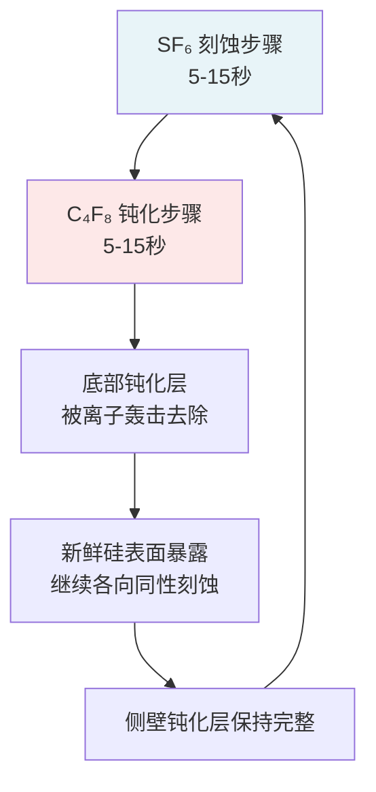

# 第七章：刻蚀与图形转移

## 7.1 刻蚀基本概念

光刻胶图形只是纳米制造的中间产物。要在衬底或薄膜中获得功能性结构，必须通过刻蚀将掩模图形忠实地转移到目标材料中。刻蚀是减材工艺的核心，贯穿集成电路制造的每一个层次。

两个参数决定了所有刻蚀工艺的保真度。

选择性（Selectivity）是目标材料刻蚀速率与掩模材料刻蚀速率之比。高选择性意味着掩模在长时间刻蚀过程中消耗极少，能够承受深度刻蚀。例如，ICP 系统中硅对氧化物的选择性可超过 200:1，硅对光刻胶的选择性可达 100:1（参见：Cui 2025, §7.3, p.279）。

各向异性（Anisotropy）表征刻蚀在纵向与横向的速率差异，定义为 A = 1 - R_L/R_V，其中 R_L 和 R_V 分别为横向与纵向刻蚀速率。完全各向异性（A=1）刻蚀能精确复制掩模尺寸；各向同性（A=0）刻蚀在各方向等速推进，导致掩模下方的横向侵蚀（参见：Campbell 2008, Ch.11, pp.283-284；Cui 2025, §7.1）。

在亚 100 nm 图形转移中，同时获得高选择性和高各向异性是核心挑战。

## 7.2 湿法刻蚀

### 7.2.1 各向同性湿法刻蚀

湿法化学刻蚀本质上是各向同性的。液态刻蚀剂从掩模开口渗透至下方，在所有方向以相近速率侵蚀材料，产生横向钻蚀（Undercut），使转移图形大于掩模尺寸。因此，湿法刻蚀通常不适用于高分辨率图形转移。0.25 μm 以上 IC 技术节点的光掩模由湿法酸蚀铬层制备，但亚 0.25 μm 的相移掩模和 OPC 掩模含有约 100 nm 的亚分辨率特征，必须转用 RIE（参见：Cui 2025, §7.2, p.259）。

然而，当刻蚀深度极浅时，横向侵蚀可忽略不计。利用自组装单分子层（SAM）作为抗蚀剂在金表面实现亚 100 nm 图形转移即为典型案例：SAM 仅 1-2 nm 厚，20 nm 线条已在 10 nm 厚金膜中通过湿法刻蚀实现（参见：Cui 2025, §7.2, p.260）。

硅的标准各向同性刻蚀剂为 HNA 体系（HF + HNO₃ + 醋酸）。HNO₃先将硅氧化，HF 再溶解生成的 SiO₂。SiO₂ 的刻蚀以 HF 为基础，缓冲氧化物刻蚀剂（Buffered Oxide Etchant, BOE）由 7 份 NH₄F 和 1 份 49% HF 组成，对 LPCVD 氧化物的刻蚀速率约 70 nm/min。6:1 HF 溶液刻蚀热氧化硅的速率约 1200 Å/min，沉积氧化物的速率更高，HF 对硅的选择性通常优于 100:1（参见：Cui 2025, §7.2, p.260；Campbell 2008, Ch.11, pp.285-286）。

Si₃N₄ 在室温 HF 中几乎不被刻蚀（<10 Å/min），需使用 140-200°C 的 H₃PO₄，典型选择性为氮化硅:氧化物 = 10:1，氮化硅:硅 = 30:1（参见：Campbell 2008, Ch.11, p.286）。

### 7.2.2 硅的各向异性湿法刻蚀

碱性刻蚀剂对晶体硅的刻蚀依赖晶面取向，是湿法各向同性的重要例外。不同晶面的原子密度差异导致刻蚀速率比约为 ⟨110⟩:⟨100⟩:⟨111⟩ = 400:200:1（参见：Cui 2025, §7.2, p.261）。在 ⟨100⟩ 晶向硅片上，KOH 刻蚀产生特征性倒金字塔结构，⟨111⟩ 面与 ⟨100⟩ 面交成 54.74° 角。在 ⟨110⟩ 硅片上，当掩模边缘精确对准 ⟨111⟩ 面时可获得垂直侧壁。

三种常用碱性刻蚀剂各有优劣：

| 刻蚀剂 | 硅刻蚀速率 | 氧化物刻蚀速率 | 表面粗糙度 | 特点 |
|--------|-----------|---------------|-----------|------|
| KOH | 最高 | 较高 | 粗糙 | 含碱金属，不兼容 CMOS |
| EDP | 中等 | 较低 | 中等 | 剧毒 |
| TMAH | 中等 | 较低 | 最光滑（比 KOH 光滑 10 倍） | 无碱金属，CMOS 兼容 |

（参见：Cui 2025, §7.2, pp.264-265）

TMAH 最适合纳米尺度硅刻蚀。40 nm 深、50 nm 宽的沟槽和 30 nm 高、40 nm 宽的脊已在 Si⟨100⟩表面实现。在 ⟨110⟩ 硅片上，低于 40 nm 的线条图形已通过碱性湿法刻蚀转移到硅中，纵横比超过 5:1，侧壁近原子级光滑（参见：Cui 2025, §7.2, pp.265-266）。

掩模与晶轴的对准至关重要。偏差导致刻蚀前沿沿晶面而非掩模边缘推进，产生粗糙、倾斜的侧壁。可通过预刻蚀一系列不同方向的沟槽确定最佳对准方向，将对准误差控制在 0.01° 以内（参见：Cui 2025, §7.2, p.264）。

### 7.2.3 金属辅助化学刻蚀

金属辅助化学刻蚀（Metal-Assisted Chemical Etching, MACE）通过贵金属催化实现硅的各向异性刻蚀。薄层贵金属（Au、Pt 或 Au/Pd）覆盖在硅表面，在 HF/H₂O₂ 混合液中催化 H₂O₂ 分解产生氧化剂，局部氧化金属下方的硅，HF 随后溶解氧化物，使金属沉入衬底形成高纵横比结构（参见：Cui 2025, §7.2, pp.265-267）。

金属的初始形貌决定结构几何。离散金属盘产生孔洞，带孔的连续金属膜产生竖立的柱阵列。已实现直径 20 nm、高度 4400 nm 的硅纳米线，以及 25 nm 线宽/25 nm 间距、深度 1.26 μm 的结构，纵横比约 50:1。气相 MACE 将纵横比推至 10000:1，刻蚀速率达 25 μm/h（参见：Cui 2025, §7.2, pp.267-268）。碳基催化剂（石墨烯、氧化石墨烯、碳纳米管）使工艺兼容 CMOS，技术已拓展至 Ge、GaAs、GaN、SiC 等半导体（参见：Cui 2025, §7.2, p.268）。

## 7.3 反应离子刻蚀

### 7.3.1 RIE 原理与机制

反应离子刻蚀（Reactive Ion Etching, RIE）是微纳制造中使用最广泛的图形转移技术。在常规平行板 RIE 系统中，射频（RF）功率施加于阴极与接地阳极之间，电离反应气体分子产生等离子体。阴极附近的自偏置电场加速离子轰击位于阴极上的样品（参见：Cui 2025, §7.3, pp.267-270；Campbell 2008, Ch.11, pp.291-294）。

  
  

    图 7-1 反应离子刻蚀（RIE）腔室截面示意图。样品置于射频驱动的阴极上，等离子体中的反应性离子在自偏压作用下垂直轰击样品表面，实现各向异性刻蚀。
  

RIE 包含四个同步过程：（a）离子溅射表面，去除污染物和原生氧化层，暴露新鲜材料表面；（b）反应性离子与材料原子直接反应生成挥发性产物；（c）离子在衬底表面解离吸附的气体分子产生自由基；（d）自由基在表面迁移并与材料原子反应生成挥发性化合物（参见：Cui 2025, §7.3, p.270）。物理轰击与化学反应的协同效应极为显著：硅暴露于 XeF₂ 气体或 Ar⁺ 离子束单独作用时，刻蚀速率均低于 1 nm/min，而两者同时存在时速率跃升至 6 nm/min（参见：Cui 2025, §7.3, p.271）。

大多数 RIE 工艺使用含卤素气体。氟基化学品（SF₆、CF₄、CHF₃）广泛用于硅和硅化合物。氯基化学品（Cl₂、BCl₃）用于铝和 III-V 族化合物。溴和碘化学品用于铟基化合物，因氯化物在室温下挥发性不足（参见：Cui 2025, §7.3, pp.269-270；Campbell 2008, Ch.11, p.292）。

| 被刻蚀材料 | 常用刻蚀气体 |
|-----------|-------------|
| 单晶硅 | CF₃Br, HBr/NF₃, SF₆/O₂ |
| 多晶硅 | SiCl₄/Cl₂, BCl₃/Cl₂, HBr/Cl₂/O₂ |
| Al | SiCl₄/Cl₂, BCl₃/Cl₂ |
| SiO₂ | CCl₂F₂, CHF₃/CF₄, CHF₃/O₂ |
| Si₃N₄ | CF₄/O₂, CF₄/H₂, CHF₃ |
| GaAs | SiCl₄/SF₆, SiCl₄/NF₃ |
| 光刻胶 | O₂ |

（参见：Cui 2025, §7.3, p.269；Campbell 2008, Ch.11, p.292）

### 7.3.2 工艺参数控制

RIE 受多个可调参数控制，各自影响刻蚀速率、选择性和各向异性（参见：Cui 2025, §7.3, pp.272-276；Campbell 2008, Ch.11）：

气体流量直接影响活性物种供给。过高流量在恒压下缩短驻留时间，降低电离效率；过低则无法补充消耗的反应气体。RF 功率增大可提升电子能量和电离概率，加快刻蚀速率，但也增大离子轰击能量，降低选择性。腔室压力决定离子平均自由程：低压（10⁻³ ~ 10⁻¹ Torr）增强各向异性，离子运动更具方向性；压力过低则等离子体无法维持。存在最佳压力使刻蚀速率与选择性同时达到最大值。衬底温度影响自由基迁移率和产物挥发性；过高温度促进各向同性的化学刻蚀并软化聚合物掩模。

气体添加剂的作用显著。向 CF₄ 中加入 10% O₂ 可使硅刻蚀速率提高 10 倍，因氧与碳基自由基反应释放氟自由基。但氧同时加速光刻胶消耗，降低选择性。Ar 可稳定等离子体并参与物理溅射，但过量会稀释反应气体（参见：Cui 2025, §7.3, pp.275-276；Campbell 2008, Ch.11, pp.294-296）。

各向异性控制的关键在于侧壁钝化。碳基化合物（来自聚合物掩模或 CHF₃ 等添加气体）沉积在刻蚀侧壁上，阻止卤素自由基的横向刻蚀，而定向离子轰击清除水平面上的钝化层。使用 SF₆/CHF₃ 混合气体，已制备纵横比达 50:1 的亚 50 nm 硅纳米线（参见：Cui 2025, §7.3, p.277）。

## 7.4 电感耦合等离子体 ICP-RIE

常规 RIE 的硅刻蚀速率通常低于 200 nm/min。增大 RF 功率可提高等离子体密度和刻蚀速率，但同时增大阴极自偏压，加剧离子轰击，劣化选择性。电感耦合等离子体（Inductively Coupled Plasma, ICP）系统巧妙地解决了这一矛盾（参见：Cui 2025, §7.3, pp.277-279）。

ICP 将等离子体产生与刻蚀腔室分离，通过独立控制等离子体密度和离子能量，实现高刻蚀速率与高选择性的兼顾。RF 功率通过感应线圈从外部耦合到等离子体腔。样品台连接独立的第二 RF 电源控制自偏压。ICP 可产生 >5×10¹¹/cm³ 的高密度等离子体（常规 RIE 仅 10⁸-10¹⁰/cm³），同时维持低离子轰击能量。最佳 ICP 系统可达约 20 μm/min 的硅刻蚀速率，硅对光刻胶选择性高达 100:1，硅对氧化物选择性超过 200:1（参见：Cui 2025, §7.3, p.279）。

ICP 不仅用于深硅刻蚀，也是石英、III-V 族半导体、碳化硅乃至钨的高效刻蚀工具。钨可在图形化铝掩模下以 2.73 μm/min 的速率刻蚀超过 300 μm 深度（参见：Cui 2025, §7.3, p.279）。

## 7.5 深反应离子刻蚀 DRIE

### 7.5.1 Bosch 工艺

深反应离子刻蚀（Deep Reactive Ion Etching, DRIE）用于制造 MEMS 高纵横比结构和集成电路的硅通孔（Through-Silicon Via, TSV）。1992 年发明的 Bosch 工艺通过交替气体切换实现侧壁钝化，保证高各向异性（参见：Cui 2025, §7.4, pp.280-281）。

  
  

    图 7-2 Bosch深反应离子刻蚀（DRIE）工艺循环示意图。SF₆各向同性刻蚀与C₄F₈钝化交替进行，离子轰击选择性去除沟槽底部钝化层，实现高纵横比深硅刻蚀。侧壁呈现特征性扇贝状形貌。
  

典型 Bosch 工艺参数：

| 参数 | 钝化步骤 | 刻蚀步骤 |
|------|---------|---------|
| C₄F₈ 流量 | 85 sccm | 0 sccm |
| SF₆ 流量 | 0 sccm | 130 sccm |
| 台面 RF 功率 | 0 W | 12 W |
| 线圈 RF 功率 | 600 W | 600 W |
| 周期时间 | 7.0 s | 9.0 s |
| 刻蚀速率 | — | 1.5-3 μm/min |

（参见：Cui 2025, §7.4, p.280）

Bosch 工艺的根本问题是扇贝效应（Scalloping）：交替切换在侧壁形成 >100 nm 的波纹状粗糙度。对微米尺度 MEMS 器件可接受，但亚 100 nm 特征尺寸不可容忍。多种方案可降低扇贝效应：延长钝化时间、使用 Teflon 涂覆样品台、或将 SF₆ 和 C₄F₈ 直接混合而不切换。非切换混合工艺已实现 16 nm 硅线结构和亚 10 nm 硅纳米线（纵横比 ~50:1，光滑侧壁），当沟槽宽度低于 5 μm 时，扇贝粗糙度随纵横比增大而显著减小，250 nm 宽沟槽已达到 160:1 纵横比（参见：Cui 2025, §7.4, pp.281-283）。

### 7.5.2 低温工艺

低温（Cryogenic）工艺是另一种侧壁钝化方案。在 -110°C~-140°C 下，SF₆ 与硅反应生成的 SiF₄ 形成 10-20 nm 保护膜覆盖侧壁，抑制横向刻蚀。氧化物掩模的选择性约 150:1，光刻胶约 70:1。低温工艺的优势是无扇贝效应，缺点是低温吸附颗粒可能产生微掩模缺陷（参见：Cui 2025, §7.4, p.283）。

| 工艺 | 特征尺寸 | 纵横比 | 刻蚀速率 | 对氧化物选择性 | 对光刻胶选择性 | 侧壁粗糙度 |
|------|---------|--------|---------|--------------|-------------|-----------|
| HBr | ≥5 nm | ≥5:1 | ≥100 nm/min | >100:1 | >3:1 | <10 nm |
| RT F-base | ≥5 nm | ≥5:1 | ≥200 nm/min | >10:1 | >5:1 | <10 nm |
| 低温 | ≥5 nm | ≥10:1 | ≥300 nm/min | >30:1 | >15:1 | <10 nm |

（参见：Cui 2025, §7.4, p.284）

### 7.5.3 DRIE 关键问题

**负载效应（Loading Effect）**：刻蚀面积增大导致反应物消耗超过供给，整体速率下降（宏观负载）；局部图形密度差异导致不同区域刻蚀深度不同（微负载）；特征尺寸减小导致刻蚀深度降低（纵横比依赖刻蚀，ARDE）。SiO₂ 刻蚀速率从 20 μm 特征尺寸的 32 nm/min 降至 52 nm 尺寸的 12 nm/min。降低腔室压力、稀释气体、脉冲等离子体或引入虚拟图形可减轻负载效应（参见：Cui 2025, §7.4, pp.284-286）。

**微沟槽效应（Microtrenching）**：高能离子在侧壁掠射反射后聚焦于沟槽底角，导致角落刻蚀速率高于中心（参见：Cui 2025, §7.4, pp.285-286）。

**刻痕效应（Notching）**：SOI 衬底的绝缘层累积正电荷，偏转入射离子导致侧向刻蚀。低频脉冲偏压可消除刻痕（参见：Cui 2025, §7.4, pp.286-287）。

**黑硅效应（Black Silicon）**：掩模材料溅射形成微掩模，产生草状硅结构。加入 O₂ 或 CHF₃ 可消除。黑硅反射率可低于 0.001%，在太阳能电池、光电探测器等领域有应用价值（参见：Cui 2025, §7.4, pp.288-289）。

## 7.6 原子层刻蚀 ALE

原子层刻蚀（Atomic Layer Etching, ALE）通过自限制表面反应每周期仅去除一个原子层。工艺分为两步循环：首先引入前驱体气体使单分子层吸附在衬底表面，排空反应物后，用低能离子束（通常 <100 eV 的 Ar⁺）轰击吸附层，诱导化学反应生成挥发性产物并排出。该过程通过前驱体单层吸附和最小化物理溅射实现自限制（参见：Cui 2025, §7.5, pp.289-291）。

对于硅，ALE 采用 Cl₂/Si 体系而非 SF₆/Si 体系，因为 F/Si 在室温下会自发刻蚀。Cl₂ 在硅表面的单层吸附仅在低能 Ar⁺（20 eV）轰击辅助下发生反应。热 ALE 无需离子轰击但需高温（>600°C），其优势是各向同性去除，可用于几乎任何几何形状的材料减薄（参见：Cui 2025, §7.5, p.290）。

ALE 首次报告于 1990 年，三十年间已有超过二十种材料验证了该技术的可行性。随着主流半导体制造推进至亚 10 nm 节点，ALE 作为 ALD 的必要对应技术受到产业界高度关注。其优势包括原子精度材料去除、极低的离子轰击损伤以及显著降低的工艺变异性（参见：Cui 2025, §7.5, pp.290-291）。

## 7.7 离子束铣削

离子束铣削（Ion Beam Milling/Etching, IBE）是纯物理溅射过程，使用惰性 Ar⁺ 离子在 10-5000 eV 能量范围内轰击样品表面去除材料。离子源独立于刻蚀腔室，产生宽束 Ar⁺ 加速射向样品。该技术的核心价值在于能够刻蚀 RIE 无法处理的材料（如磁性材料），因为 RIE 要求生成挥发性化合物，而许多材料做不到这一点（参见：Cui 2025, §7.6, pp.291-294）。

典型离子铣削速率：

| 材料 | 刻蚀速率 (Å/min) |
|------|-----------------|
| 金 | 1000 |
| 铜 | 700 |
| 光刻胶 (AZ-1350) | 200 |
| 镍铬 (NiCr) | 170 |
| 氧化铝 (Al₂O₃) | 90 |

（参见：Cui 2025, §7.6, p.292）

离子铣削的主要问题包括：选择性低（仅取决于不同材料的溅射产额差异）；溅射产物非挥发性，会重沉积到相邻结构上；掩模消耗导致的刻面效应（Faceting），即掩模顶部棱角优先侵蚀使刻蚀轮廓倾斜。引入反应气体（如 CHF₃）可部分提高选择性，旋转倾斜样品可减少重沉积。HSQ 负胶已被用作离子铣削掩模制备 30 nm 金纳米结构（参见：Cui 2025, §7.6, pp.293-294）。

## 7.8 刻蚀工艺选择指南

<strong>工艺选择决策矩阵</strong> 
选择刻蚀工艺时需综合考虑：材料类型（是否能形成挥发性化合物）、特征尺寸（亚 100 nm 排除普通湿法刻蚀）、纵横比需求（高纵横比需 DRIE 或 MACE）、侧壁质量要求（低粗糙度排除标准 Bosch）、损伤容忍度（敏感器件考虑 ALE）以及产线兼容性（CMOS 排除含碱金属的 KOH）。

| 应用场景 | 推荐技术 | 关键优势 |
|---------|---------|---------|
| MEMS 深硅结构 | Bosch DRIE | 高速、高纵横比 |
| 亚 10 nm 栅极精修 | ALE | 原子精度、低损伤 |
| 磁性材料图形化 | 离子铣削 | 材料无限制 |
| 纳米硅线阵列 | MACE | 极高纵横比、低成本 |
| III-V 化合物 | ICP-RIE (Cl₂/BCl₃) | 高选择性、可控轮廓 |
| TSV 通孔 | DRIE + 低频脉冲 | 深度 >100 μm、无刻痕 |
| SiO₂ 选择性刻蚀 | CHF₃/CF₄ RIE | 对硅高选择性 |

## 本章小结

刻蚀技术构成纳米制造中图形转移的基础。湿法刻蚀以化学选择性见长，碱性各向异性刻蚀在 ⟨110⟩ 硅片上可制备亚 40 nm 垂直侧壁结构，MACE 将纵横比推至极限。RIE 凭借物理轰击与化学反应的协同实现亚 100 nm 各向异性刻蚀，ICP 解决了高等离子体密度与高选择性的矛盾。DRIE 的 Bosch 工艺和低温工艺为 MEMS 和 TSV 提供深度刻蚀能力，各有扇贝效应和低温缺陷的权衡。ALE 以自限制反应实现原子级精度，是亚 10 nm 节点不可或缺的工具。离子铣削弥补了 RIE 在非挥发性材料上的空白。实际应用中，刻蚀工艺的选择取决于材料特性、尺寸要求、损伤容忍度和产线兼容性的综合权衡。

