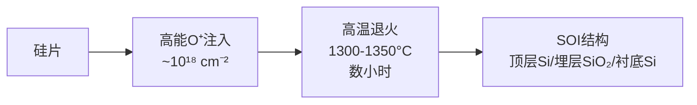

# 第十章：半导体衬底与热处理工艺

## 10.1 概述

集成电路和纳米器件的制造始于半导体衬底（Semiconductor Substrate）。衬底的纯度、晶体完美性和掺杂控制直接决定了其上所有器件的性能极限。本章系统阐述单晶硅衬底的生长方法、杂质引入与再分布的物理机制、热氧化生长二氧化硅、离子注入以及快速热处理工艺。这些单元工艺共同构成了现代半导体制造的热处理基础。（参见：Campbell 2008, Ch.2-6）

## 10.2 硅单晶生长

### 10.2.1 直拉法

直拉法（Czochralski Method, CZ）是生产单晶硅片的主流技术。工艺以电子级多晶硅为原料，其纯度经蒸馏精炼可达99.999999999%（11N）。多晶硅装入熔融石英坩埚（Fused Silica Crucible），在真空腔体内充入氩气保护气氛后，坩埚加热至约1500°C使硅完全熔化。（参见：Campbell 2008, Ch.2, pp.22-29）

生长过程的关键步骤：

1. 将精心取向的籽晶（Seed Crystal，直径约0.5 cm，长约10 cm）降入硅熔体表面
2. 通过Dash缩颈技术快速拉伸形成细颈区域，消除籽晶中的位错
3. 降低熔体温度并减缓拉速，使晶体扩肩至目标直径
4. 利用光学探测器反馈控制拉速和炉温，维持恒定直径

现代CZ硅锭直径超过300 mm，长度达1至2米（参见：Campbell 2008, Ch.2）。

**热平衡与最大拉速。** 在液固界面处，能量守恒要求固体一侧传导的热量减去液体一侧传入的热量等于凝固释放的潜热（硅的熔化潜热约340 cal/g）。由此可推导最大拉速：

$$V_{max} = \frac{k_s}{ρL} \cdot \frac{dT}{dx}\bigg|_s$$

典型硅CZ生长的温度梯度约100°C/cm（参见：Campbell 2008, Ch.2）。为减小熔体中温度梯度，晶锭和坩埚在生长过程中反向旋转。（参见：Campbell 2008, Ch.2, pp.23-25）

**掺杂与分凝。** 通过向熔体中加入精确质量的掺杂剂原子来控制晶片电阻率。但杂质在液固界面发生分凝效应，分凝系数 k 定义为：

$$k = \frac{C_s}{C_l}$$

| 杂质元素 | Al | As | B | O | P | Sb |
|---------|------|------|------|-------|------|-------|
| 分凝系数k | 0.002 | 0.3 | 0.8 | 0.25* | 0.35 | 0.023 |

*氧的分凝系数存在争议，有文献报道接近1.0的数值。

（参见：Campbell 2008, Ch.2, Table 2.1, p.27）

假设熔体充分混合，固体中杂质浓度随凝固比例X变化为：

$$C_s = kC_0(1-X)^{k-1}$$

实际上由于坩埚壁热梯度引起自然对流形成循环胞（Recirculation Cells），熔体并非完全均匀混合。考虑液固界面处的边界层效应，有效分凝系数修正为：

$$k_e = \frac{k}{k + (1-k)e^{-Vδ/D}}$$

**氧控制与磁场拉晶。** 由于熔融石英坩埚在1500°C下释放大量氧进入硅熔体，超过95%的溶解氧以SiO形式从熔体表面逸出，其余氧被掺入生长晶体。为降低氧含量，可采用磁场约束直拉法（Magnetic Czochralski, MCZ）。磁场通过洛伦兹力改变离子化杂质在熔体中的运动轨迹，减少杂质掺入晶体。典型磁场强度约0.3 T，可将氧浓度降至2 ppm。（参见：Campbell 2008, Ch.2, pp.26-29）

### 10.2.2 区熔法

区熔法（Float Zone Method, FZ）适用于需要极高纯度硅的场合。FZ硅的载流子浓度可低至10¹¹ cm⁻³，远低于CZ硅。

FZ法的核心特征是熔化部分完全由固体部分支撑，无需坩埚。高纯多晶硅棒固定在卡盘上，射频线圈沿棒长方向缓慢移动。线圈产生的电磁场在硅棒中感应涡流，通过焦耳热使最近区域局部熔化。整套装置可置于真空系统或惰性气体保护环境中。（参见：Campbell 2008, Ch.2, pp.32-33）

FZ硅的掺杂方法包括四种：

| 掺杂方法 | 原理 | 适用杂质 |
|---------|------|---------|
| 芯棒掺杂（Core Doping） | 以掺杂多晶硅棒为起始材料 | B（扩散率高，不易蒸发） |
| 丸粒掺杂（Pill Doping） | 在棒顶部钻孔填入掺杂剂 | Ga, In（分凝系数小） |
| 气相掺杂（Gas Doping） | 注入PH₃, AsCl₃, BCl₃等气体 | P, As, B |
| 中子嬗变掺杂（NTD） | ³⁰Si(n,γ)→³¹Si→³¹P+β | P（轻n型掺杂） |

中子嬗变掺杂利用硅中约3.1%的³⁰Si同位素，在中子辐照下转变为磷，实现极其均匀的轻度n型掺杂。缺点是无法制备p型硅。（参见：Campbell 2008, Ch.2, pp.33-34）

### 10.2.3 晶向选择与晶片规格

晶锭生长完成后需经过一系列加工步骤制备晶片。电阻率和晶体完美性检测之后，切去头尾，机械修整至目标直径。对150 mm及以下晶片，沿晶锭全长磨制定位平面（Flat）标识晶向和掺杂类型；较大晶片则采用切口（Notch）标识。

主要的硅晶向选择依据：

- **(100)晶向：** CMOS工艺首选。Si/SiO₂界面态密度最低，氧化速率各向异性有利于LOCOS工艺（参见：Campbell 2008, Ch.2）
- **(111)晶向：** 双极型器件使用。沿此方向的外延生长质量较好

| 参数 | 典型规格（先进硅片） |
|------|-------------------|
| 直径 | 300 mm |
| 厚度 | 625 或 675 μm |
| 弓形度 | ≤10 μm |
| 全局平坦度 | ≤3 μm |
| 电阻率 | 按指定 ±3% |
| 氧浓度 | 1.5×10¹⁷ cm⁻³ |
| 金属污染（体内） | <0.001 ppb |

（参见：Campbell 2008, Ch.2, Table 2.4, pp.34-35）

## 10.3 热氧化

### 10.3.1 Deal-Grove模型

硅在分子氧中的热氧化反应为：

$$Si(固) + O_2(气) → SiO_2$$

此过程称为干氧氧化（Dry Oxidation）。Deal-Grove模型适用于预测厚度大于约300 Å的热氧化层生长。（参见：Campbell 2008, Ch.4, pp.74-77）

模型考虑三个氧通量的平衡：

1. **气相传输通量 J₁：** 氧从气体主体通过边界层扩散至氧化层表面，J₁ = h_g(C_g - C_s)
2. **氧化层内扩散通量 J₂：** 氧穿过已生长氧化层的扩散，J₂ = D_{O₂}(C_o - C_i)/t_{ox}
3. **界面反应通量 J₃：** 氧在Si-SiO₂界面的化学反应，J₃ = k_s·C_i

稳态下三者相等。结合Henry定律（C_o = Hp_g），解方程可得氧化层厚度随时间的关系：

$$t_{ox}^2 + At_{ox} = B(t + τ)$$

其中：

$$A = 2D\left(\frac{1}{k_s} + \frac{1}{h}\right), \quad B = \frac{2DHp_g}{N_1}, \quad τ = \frac{t_0^2 + At_0}{B}$$

N₁为SiO₂中每单位体积的氧分子数（干氧化时为2.2×10²² cm⁻³）。τ参数补偿初始氧化层厚度t₀的效应。（参见：Campbell 2008, Ch.4, pp.75-77）

<strong>工艺要点：</strong>氧化消耗的硅厚度约为最终氧化层厚度的44%（参见：Campbell 2008, Ch.4）。化学反应发生在Si-SiO₂界面处，因为氧在SiO₂中的扩散率远高于硅在SiO₂中的扩散率。因此热氧化产生的界面未暴露于大气环境，相对纯净。

### 10.3.2 线性和抛物线速率系数

Deal-Grove方程有两个重要极限形式：

- **薄氧化层（线性区）：** t_ox ≈ (B/A)(t + τ)，氧化速率由界面反应控制
- **厚氧化层（抛物线区）：** t_ox² ≈ B(t + τ)，氧化速率由扩散控制

B/A称为线性速率系数，B称为抛物线速率系数。

**干氧氧化参数：**

| 温度(°C) | A(μm) | B(μm²/hr) | τ(hr) |
|---------|-------|-----------|-------|
| 800 | 0.370 | 0.0011 | 9 |
| 920 | 0.235 | 0.0049 | 1.4 |
| 1000 | 0.165 | 0.0117 | 0.37 |
| 1100 | 0.090 | 0.027 | 0.076 |
| 1200 | 0.040 | 0.045 | 0.027 |

**湿氧氧化参数（640 torr H₂O）：**

| 温度(°C) | A(μm) | B(μm²/hr) |
|---------|-------|-----------|
| 920 | 0.50 | 0.203 |
| 1000 | 0.226 | 0.287 |
| 1100 | 0.11 | 0.510 |
| 1200 | 0.05 | 0.720 |

（参见：Campbell 2008, Ch.4, Table 4.1, pp.78-79）

湿氧氧化速率远高于干氧氧化，原因在于H₂O在SiO₂中的扩散率高于O₂，且H₂O的溶解度（Henry常数）远大于O₂（参见：Campbell 2008, Ch.4）。但湿氧生长的氧化层密度较低，通常用于不承受显著电应力的厚氧化层。

**氯气添加。** 在干氧中添加1-3%的氯（通常以HCl形式），可使重金属杂质形成挥发性氯化物而被清除。加3% HCl可使线性速率系数增加一倍（参见：Campbell 2008, Ch.4）。氯气氧化还改善了Si/SiO₂界面质量。（参见：Campbell 2008, Ch.4, pp.79-80）

### 10.3.3 薄氧化层的初始增强

Deal-Grove模型在氧化层厚度低于几百埃时预测值偏低。实验观测表明，极薄氧化层的氧化速率比模型预测值高4倍以上（参见：Campbell 2008, Ch.4）。Deal-Grove方程中的τ参数可部分补偿这一偏差，但准确描述超薄氧化层生长需要额外的修正模型。（参见：Campbell 2008, Ch.4, pp.81-83）

### 10.3.4 晶向与掺杂效应

**(111)硅的氧化速率高于(100)硅。** 这反映在线性速率系数B/A的差异中，因为界面反应速率取决于可用键的面密度。抛物线速率系数B与晶向无关，因为氧在非晶SiO₂中的扩散不依赖于衬底取向（参见：Campbell 2008, Ch.4）。

重掺杂会增加氧化速率。高浓度n型掺杂（如磷、砷）显著增加线性速率系数。（参见：Campbell 2008, Ch.4, pp.91-94）

## 10.4 扩散

### 10.4.1 Fick定律

扩散是杂质原子在浓度梯度驱动下通过随机热运动产生的净迁移。Fick第一定律描述扩散通量：

$$J = -D\frac{\partial C(x,t)}{\partial x}$$

Fick第二定律给出浓度随时间和位置的变化：

$$\frac{\partial C(z,t)}{\partial t} = D\frac{\partial^2 C(z,t)}{\partial z^2}$$

此方程在位置上二阶、时间上一阶，需要至少两个独立边界条件求解。（参见：Campbell 2008, Ch.3, pp.43-45）

### 10.4.2 预沉积与推进扩散

**预沉积扩散（Predeposition）。** 表面浓度固定在固溶度C_s，解为互补误差函数：

$$C(z,t) = C_s \cdot \text{erfc}\left(\frac{z}{2\sqrt{Dt}}\right)$$

总剂量随时间增加：$Q_T = \frac{2}{\sqrt{\pi}}C_s\sqrt{Dt}$

**推进扩散（Drive-in）。** 初始剂量Q_T固定，表面封闭，解为高斯分布：

$$C(z,t) = \frac{Q_T}{\sqrt{\pi Dt}} \exp\left(-\frac{z^2}{4Dt}\right)$$

表面浓度随时间降低：$C_s = Q_T / \sqrt{\pi Dt}$

经典工艺流程为先做预沉积引入杂质，再做推进扩散形成所需结深。推进近似的前提是$\sqrt{Dt}_{predep} \ll \sqrt{Dt}_{drive-in}$。（参见：Campbell 2008, Ch.3, pp.50-52）

### 10.4.3 扩散系数

扩散系数遵循Arrhenius关系：$D = D_0 e^{-E_a/kT}$

Fair的空位模型将总扩散系数表示为各电荷态空位贡献的叠加：

$$D = D^o + D^- \frac{n}{n_i} + D^{=}\left(\frac{n}{n_i}\right)^2 + D^+ \frac{p}{n_i} + \cdots$$

**硅中常见掺杂剂的本征扩散系数：**

| 杂质 | 类型 | D₀(cm²/s) | E_a(eV) | D⁻₀(cm²/s) | E⁻_a(eV) |
|------|------|-----------|---------|-------------|----------|
| As in Si | 施主 | 0.066 | 3.44 | 12.0 | 4.05 |
| P in Si | 施主 | 3.9 | 3.66 | 4.4 | 4.0 |
| Sb in Si | 施主 | 0.21 | 3.65 | 15.0 | 4.08 |
| B in Si | 受主 | 0.037 | 3.46 | — | — |
| B in Si | 受主（D⁺） | — | — | 0.41* | 3.46* |

*硼的增强扩散通过正电荷空位D⁺项描述。

（参见：Campbell 2008, Ch.3, Table 3.2, pp.47-48）

**扩散机制分类。** 替位杂质（P, B, As, Sb等）通过空位交换或间隙体机制扩散。硼和磷同时通过两种机制扩散，具体哪种占主导取决于工艺条件。砷主要通过空位机制扩散。氧化增强扩散（Oxidation-Enhanced Diffusion, OED）使硼和磷的扩散率增大，而砷的扩散率因氧化减小（参见：Campbell 2008, Ch.3）。（参见：Campbell 2008, Ch.3, pp.46-50）

### 10.4.4 SiO₂中的扩散

SiO₂中杂质扩散在深亚微米器件中至关重要。当重掺杂多晶硅栅极中的硼穿过厚度仅2 nm的栅氧化层时（硼穿透效应），将偏移器件阈值电压。氮化处理可有效阻止硼在SiO₂中的扩散（参见：Campbell 2008, Ch.3），因为氮阻断了硼从四配位硅到三配位硼的键重排。（参见：Campbell 2008, Ch.3, pp.62-64）

## 10.5 离子注入

### 10.5.1 注入系统与基本原理

离子注入（Ion Implantation）将高能离子直接打入晶片，精确控制杂质的剂量和深度分布，是现代IC制造中掺杂的主要方法。典型系统包含离子源、质量分析磁铁、加速管和终端站。（参见：Campbell 2008, Ch.5, pp.107-113）

离子进入固体后通过两种机制损失能量：

- **电子阻止Se：** 类似粘滞阻力，$S_e \propto \sqrt{E}$，为连续过程
- **核阻止Sn：** 离散碰撞事件，低能时随能量增大，高能时因碰撞时间缩短而减小

### 10.5.2 投影射程与歧离

杂质浓度近似为高斯分布：

$$N(x) = \frac{\Phi}{\sqrt{2\pi}\Delta R_p} \exp\left(-\frac{(x-R_p)^2}{2\Delta R_p^2}\right)$$

其中R_p为投影射程，ΔR_p为标准偏差（歧离, Straggle），Φ为注入剂量。

**硅中常见杂质的注入参数（100 keV）：**

| 杂质 | R_p(Å) | ΔR_p(Å) |
|------|--------|---------|
| B | ~3000 | ~700 |
| P | ~1200 | ~450 |
| As | ~600 | ~200 |
| Sb | ~400 | ~150 |

射程估算公式：$\Delta R_p \approx \frac{2}{3}R_p \frac{\sqrt{M_i M_t}}{M_i + M_t}$

（参见：Campbell 2008, Ch.5, Fig.5.9, pp.118-119）

### 10.5.3 沟道效应

当离子速度方向平行于主要晶轴时，可能发生沟道效应（Channeling），导致部分离子深入晶体远超正常射程。临界角：

$$\psi_c = 9.73° \sqrt{\frac{Z_i Z_t}{E \cdot d}}$$

其中E为入射能量（keV），d为沿离子方向的原子间距（Å）。例如100 keV硼注入(100)硅的临界角约6°。

**抑制沟道效应的方法：**
- 偏转注入：典型倾斜角7°，扭转角30°
- 通过薄屏蔽氧化层注入使离子速度随机化
- 预非晶化（Preamorphization）：先用Si, F或Ar高剂量注入破坏晶格

（参见：Campbell 2008, Ch.5, pp.120-122）

### 10.5.4 注入损伤

高能离子与晶格原子碰撞产生大量位移原子。当注入剂量超过临界非晶化剂量时，硅表层转变为非晶态。注入后必须通过退火修复损伤并激活杂质（使注入原子占据替位位置）。（参见：Campbell 2008, Ch.5, pp.122-126）

## 10.6 退火工艺

### 10.6.1 炉退火与快速热处理

**传统炉退火（Furnace Annealing）** 为批量工艺，晶片从边缘向内加热。为避免因温度梯度过大导致翘曲，升降温速率受限，即使目标退火时间很短，长温度斜坡也会带来显著扩散。

**快速热处理（Rapid Thermal Processing, RTP）** 是一系列单片热处理工艺的总称，通过缩短高温停留时间来降低热预算（Thermal Budget）。RTP最初开发用于注入退火，现已扩展至氧化、CVD和外延生长。（参见：Campbell 2008, Ch.6, pp.140-141）

RTP系统按加热方式分为三类：

| 类型 | 热源 | 特点 |
|------|------|------|
| 绝热型 | 准分子激光宽束 | 仅加热表面几微米，时间最短 |
| 热通量型 | 聚焦激光/电子束扫描 | 横向温度非均匀性大 |
| 等温型 | 钨卤素灯阵列 | 温度均匀性最好，工业主流 |

现代RTP系统采用多区加热（Multizone Heating）设计，独立控制不同区域灯功率，补偿晶片边缘散热增大的效应。200 mm晶片通常需要100个以上1 kW灯泡。（参见：Campbell 2008, Ch.6, pp.144-147）

### 10.6.2 瞬态增强扩散

低温退火注入晶片时，观测到的结深远大于简单扩散理论预测值。硼在硅中的扩散增强可达1000倍（参见：Campbell 2008, Ch.6）。增强的原因在于注入产生的高浓度空位和自间隙体尚未湮灭，这些过剩点缺陷加速了杂质扩散。此效应称为瞬态增强扩散（Transient Enhanced Diffusion, TED）。

**TED与稳态扩散的激活能对比：**

| 杂质 | 稳态激活能(eV) | 瞬态激活能(eV) |
|------|--------------|--------------|
| B | 3.5 | 1.8 |
| As | 3.4 | 1.8 |
| P | 3.6 | 2.2 |

TED的激活能约为稳态扩散的一半，表明点缺陷辅助的扩散机制在低温下更为有效。为减轻TED，常在激活退火前先进行500-650°C的低温退火步骤，湮灭过剩点缺陷。（参见：Campbell 2008, Ch.6, Table 6.1, pp.152-153）

### 10.6.3 快速热激活

RTP的突出优势在于晶片可能未达到热力学平衡。这意味着电活性掺杂浓度实际上可以超过固溶度。砷在毫秒级退火后激活浓度可达约3×10²¹ cm⁻³，约为其固溶度的10倍（参见：Campbell 2008, Ch.6），因为砷原子没有足够时间形成团簇（Cluster）并凝结为非活性缺陷。（参见：Campbell 2008, Ch.6, pp.152-154）

RTP退火后硼的尾部低浓度区域可能未完全激活，导致电学结深浅于化学结深。未激活的杂质被认为形成了非活性的硼-间隙体对（Boron Interstitial Pairs）（参见：Campbell 2008, Ch.6）。

### 10.6.4 快速热氧化

快速热氧化（Rapid Thermal Oxidation, RTO）允许在高温下进行短时间氧化，同时保持良好的固定电荷和界面态密度。传统方法通过降温减慢氧化速率来生长超薄栅氧化层，但低温生长的氧化层电学质量下降。RTO克服了这一矛盾。（参见：Campbell 2008, Ch.6, pp.154-155）

## 10.7 SOI衬底

### 10.7.1 SIMOX技术

注氧隔离（Separation by IMplanted OXygen, SIMOX）由Izumi等人于1978年首次报道。SIMOX通过高能高剂量氧离子注入硅片，再经高温退火形成埋层SiO₂。其优势包括增强抗辐射能力、提高电路速度和增大封装密度。（参见：Campbell 2008, Ch.5, pp.128-130）

典型SIMOX工艺流程：

SIMOX面临的主要问题包括注入过程引入的重金属杂质污染和颗粒缺陷。典型SIMOX注入剂量比常规源漏注入高约三个数量级，对注入机的洁净度提出严格要求。已有SIMOX SRAM（256K）和BiCMOS器件的报道，少数载流子寿命约10⁻⁷秒。（参见：Campbell 2008, Ch.5, pp.128-130）

### 10.7.2 键合SOI与Smart Cut

Smart Cut技术结合了氢离子注入和晶片键合。先向一片硅片注入氢离子形成微气泡层，将其与另一片硅片（带有氧化层）键合，然后在氢注入层处剥离，最终抛光获得高质量SOI衬底。此技术较SIMOX具有更好的顶层硅厚度均匀性和更低的缺陷密度。（参见：Campbell 2008, Ch.5, §5.7）

## 10.8 本章小结

本章涵盖了半导体衬底与热处理工艺的核心内容：

1. **晶体生长：** CZ法是商用硅片的主流技术，通过拉速和温度控制实现单晶生长。FZ法提供更高纯度硅，适用于功率器件和探测器衬底。分凝效应影响杂质沿晶锭方向的分布均匀性。

2. **热氧化：** Deal-Grove模型准确描述了300 Å以上热氧化层的生长动力学。氧化分为反应速率控制的线性区和扩散控制的抛物线区。湿氧氧化速率远高于干氧，但氧化层密度较低。

3. **扩散：** Fick定律描述杂质在浓度梯度下的再分布。预沉积（erfc分布）和推进（高斯分布）是两种基本扩散模式。高浓度掺杂时扩散系数与浓度相关，需数值求解。

4. **离子注入：** 提供精确的剂量和深度控制。投影射程和歧离可通过LSS表或Monte Carlo模拟获得。沟道效应通过偏转注入和预非晶化来抑制。

5. **退火工艺：** RTP通过缩短高温时间降低热预算。TED是注入后退火中需特别关注的现象，其激活能约为稳态扩散的一半。超快退火可实现超固溶度激活。

6. **SOI衬底：** SIMOX和Smart Cut为两种主要SOI制备技术，在高速、低功耗和抗辐射器件中具有重要应用。

