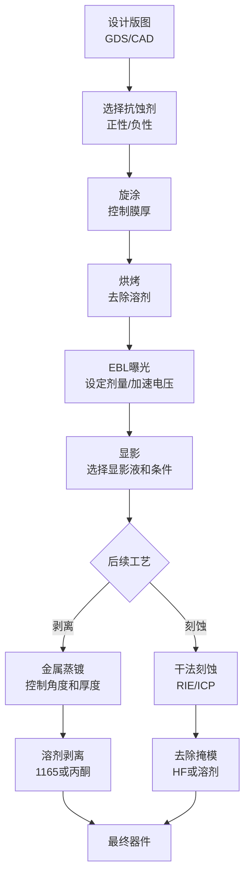

# 第十一章：工艺配方手册

## 11.1 概述

本章汇编电子束光刻（Electron Beam Lithography, EBL）相关的工艺配方，涵盖抗蚀剂涂覆、曝光参数、显影条件、金属剥离和刻蚀工艺。所有配方基于Georgia Tech电子束光刻设施的实测数据，以Elionix ELS-G100（100 kV）系统为平台。工艺参数经过实验验证，可直接用于纳米结构加工。（参见：GT EBL Facility, "Facility Overview"）

<div class="pro-tip">
<strong>工艺要点：</strong>本章提供的参数为参考起点。实际工艺需根据具体设备、环境条件和衬底材料进行优化。建议先在测试样品上验证参数后再用于正式器件加工。
</div>

## 11.2 EBL系统规格

Elionix ELS-G100系统的关键参数：

| 参数 | 规格 |
|------|------|
| 束斑直径 | 1.8 nm（高斯束） |
| 加速电压 | 25, 50, 100 kV 可选 |
| 束流范围 | 20 pA 至 100 nA |
| 扫描速度 | 100 MHz |
| 电子源 | ZrO/W热场发射 |
| 最小线宽 | 6 nm |
| 场拼接精度 | 15 nm（100 μm场） |
| 套刻精度 | 20 nm（100 μm场） |
| 最大晶片尺寸 | 8英寸 |
| 最小样品尺寸 | 毫米级碎片 |

（参见：GT EBL Facility, "Equipment Specifications"）

## 11.3 抗蚀剂材料选型

### 11.3.1 正性抗蚀剂

#### PMMA（950k分子量）

PMMA（聚甲基丙烯酸甲酯, Polymethyl Methacrylate）是最经典的电子束抗蚀剂，具有优异的分辨率和易于去除的特性，价格低廉，首选用于剥离工艺。（参见：GT EBL Facility, "PMMA Process"）

#### ZEP520A

<span class="key-insight">ZEP520A所需曝光剂量比PMMA低约20%，写入时间更短。等离子体刻蚀抗性约为PMMA的2倍。但成本超过PMMA的25倍。</span>（参见：GT EBL Facility, "ZEP520A Process"）

### 11.3.2 负性抗蚀剂

#### HSQ（氢化硅倍半氧烷, Hydrogen Silsesquioxane）

HSQ为无机负性抗蚀剂，EBL曝光后转化为SiO₂。具有优异的等离子体刻蚀抗性和对硅的选择性。<span class="key-insight">已实现6.5 nm孤立线和40 nm周期上10 nm点阵的记录。</span>但所需剂量约为PMMA的3倍，线边缘粗糙度较高。（参见：GT EBL Facility, "HSQ Process"）

#### ma-N 2403

负性聚合物抗蚀剂，适用于玻璃衬底上的剥离工艺。可用有机溶剂去除，无需HF基刻蚀液。具备深紫外曝光能力。分辨率低于HSQ，部分衬底上存在附着力问题。（参见：GT EBL Facility, "ma-N 2403 Process"）

### 11.3.3 抗蚀剂对比总表

| 参数 | PMMA (950k) | ZEP520A | HSQ | ma-N 2403 |
|------|-------------|---------|-----|-----------|
| 极性 | 正性 | 正性 | 负性 | 负性 |
| 相对剂量 | 1× (基准) | ~0.8× | ~3× | — |
| 刻蚀抗性 | 基准 | ~2× PMMA | 优异(SiO₂) | — |
| 分辨率 | 优 | 优 | 最佳(6.5 nm) | 低于HSQ |
| 成本 | 低 | >25× PMMA | 高 | 中等 |
| 去除方式 | 丙酮/1165 | 有机溶剂 | HF/BOE | 有机溶剂 |
| 最佳应用 | 剥离 | 快速写入, 刻蚀 | 最高分辨率, 刻蚀掩模 | 玻璃衬底剥离 |
| 烘烤条件 | 180°C, 90 s | 见设备手册 | 80-250°C(取决于工艺) | 见设备手册 |

（参见：GT EBL Facility, "Resist Materials Overview"）

## 11.4 PMMA工艺配方

### 配方11-1：PMMA标准工艺

```
━━━━━━━━━━━━━━━━━━━━━━━━━━━━━━━━━
 PMMA (950k MW) 标准工艺
 适用：一般纳米图形化，金属剥离
━━━━━━━━━━━━━━━━━━━━━━━━━━━━━━━━━
```

**步骤1：旋涂**
- 旋涂PMMA，60秒
- 转速按照旋涂曲线（Spin Speed Curve）查表确定膜厚

**步骤2：烘烤**
- 180°C热板，90秒

**步骤3：曝光**
- 参照剂量敏感曲线（Dose Sensitivity Curve）设定曝光剂量

**步骤4：显影**
- 浸泡显影2分钟

**步骤5：冲洗**
- 异丙醇（IPA）冲洗30秒

**步骤6：吹干**
- 氮气吹干

（参见：GT EBL Facility, "PMMA Process", "Standard Process Recipe"）

### 配方11-2：PMMA显影条件选择

| 显影液 | 配比 | 显影时间 | 分辨率等级 | 说明 |
|--------|------|---------|-----------|------|
| IPA:H₂O | 3:1 | 2 min | 标准 | 易获取，溶剂用量少 |
| MIBK:IPA | 1:1 | 2 min | 标准 | 传统配方 |
| MIBK:IPA | 1:3 | 2 min | 高 | 需增大曝光剂量 |
| 冷显影 | 任意配比 | 30 s | 最高 | 将显影液冷却至10°C以下，增大剂量 |

（参见：GT EBL Facility, "PMMA Process", "Development Options"）

<div class="pro-tip">
<strong>工艺要点：</strong>提高分辨率的方法包括缩短显影时间（可缩至约30秒并相应增大曝光剂量）和采用冷显影。冷显影将温度从室温（约19°C）降至10°C以下，主要用于40 nm以下特征尺寸。大多数应用使用室温标准显影即可满足需求。
</div>

### 配方11-3：PMMA去除

| 步骤 | 方法 |
|------|------|
| 1 | 浸泡在丙酮或1165（N-甲基吡咯烷酮）中 |
| 2 | O₂等离子体处理 |
| 3 | 食人鱼液（Piranha）清洗 |

（参见：GT EBL Facility, "PMMA Process", "PMMA Removal Process"）

## 11.5 HSQ工艺配方

<div class="pro-tip">
<strong>工艺要点：</strong>HSQ对涂覆与曝光之间的时间间隔敏感。涂覆后应尽快曝光以获得最佳结果。EBL曝光后HSQ转化为二氧化硅。
</div>

### 配方11-4：HSQ低对比度工艺（快速）

```
━━━━━━━━━━━━━━━━━━━━━━━━━━━━━━━━━
 HSQ 工艺 1：低对比度，快速
 适用：一般刻蚀掩模，工艺窗口较大
━━━━━━━━━━━━━━━━━━━━━━━━━━━━━━━━━
```

| 参数 | 数值 |
|------|------|
| 涂覆后烘烤 | 250°C，2分钟 |
| 曝光剂量 | ~1000 μC/cm² |
| 显影液 | 2.3% TMAH (MF-319) |
| 显影时间 | 70秒，室温 |
| 冲洗 | 流动DI水约60秒 |

### 配方11-5：HSQ高对比度工艺（中等剂量）

```
━━━━━━━━━━━━━━━━━━━━━━━━━━━━━━━━━
 HSQ 工艺 2：高对比度，中等剂量
 适用：精细结构，需要陡直侧壁
━━━━━━━━━━━━━━━━━━━━━━━━━━━━━━━━━
```

| 参数 | 数值 |
|------|------|
| 涂覆后烘烤 | 不烘烤，或80°C，4分钟 |
| 曝光剂量 | ~1500 μC/cm² |
| 显影液 | 25% TMAH |
| 显影时间 | 30秒，约21°C |
| 冲洗 | 流动DI水约60秒 |

### 配方11-6：HSQ最高对比度工艺（高剂量）

```
━━━━━━━━━━━━━━━━━━━━━━━━━━━━━━━━━
 HSQ 工艺 3：最高对比度，高剂量
 适用：最高分辨率结构（<10 nm）
━━━━━━━━━━━━━━━━━━━━━━━━━━━━━━━━━
```

| 参数 | 数值 |
|------|------|
| 涂覆后烘烤 | 不烘烤，或80°C，4分钟 |
| 曝光剂量 | ~2000 μC/cm² |
| 显影液 | 25% TMAH，40-50°C |
| 显影时间 | 30秒 |
| 冲洗 | 流动DI水约60秒 |

（参见：GT EBL Facility, "HSQ Process", "Development Process Recipes"）

**HSQ对比度工艺选择要点：**
- 更高对比度工艺需要更大剂量和更长写入时间
- <span class="key-insight">更高对比度提供更陡直的侧壁和更宽的工艺窗口</span>
- HSQ的线边缘粗糙度高于正性抗蚀剂

### 配方11-7：HSQ去除

HSQ曝光后转化为SiO₂，用HF或缓冲氧化物刻蚀液（Buffered Oxide Etch, BOE）去除。

| 材料 | HF刻蚀速率 |
|------|-----------|
| 热氧化SiO₂ | ~100 nm/min |
| PECVD氧化物 | ~490 nm/min |
| 曝光后HSQ | 远快于热氧化物 |

（参见：GT EBL Facility, "HSQ Process", "HSQ Removal"）

## 11.6 曝光剂量参考

### 11.6.1 剂量汇总

| 抗蚀剂 | 显影液 | 浓度/配比 | 温度 | 时间 | 剂量(μC/cm²) | 对比度 |
|--------|--------|----------|------|------|-------------|--------|
| PMMA | IPA:H₂O | 3:1 | RT | 2 min | 参照曲线 | 标准 |
| PMMA | MIBK:IPA | 1:1 | RT | 2 min | 参照曲线 | 标准 |
| PMMA | MIBK:IPA | 1:3 | RT | 2 min | 较高 | 高 |
| PMMA | 冷显影 | 任意 | ≤10°C | 30 s | 更高 | 最高 |
| HSQ | TMAH(MF-319) | 2.3% | RT | 70 s | ~1000 | 低 |
| HSQ | TMAH | 25% | ~21°C | 30 s | ~1500 | 高 |
| HSQ | TMAH | 25% | 40-50°C | 30 s | ~2000 | 最高 |

（参见：GT EBL Facility, "Quick Reference: Development Conditions"）

<div class="pro-tip">
<strong>工艺要点：</strong>ZEP520A所需曝光剂量约为PMMA的80%，写入时间更短。但其成本为PMMA的25倍以上，适用于需要快速写入且对刻蚀抗性有要求的场合。
</div>

## 11.7 金属剥离工艺

### 11.7.1 剥离原理

剥离工艺（Liftoff）利用抗蚀剂作为模板层，先将金属蒸镀至表面，然后用溶剂去除抗蚀剂层，抗蚀剂之上的金属随之剥离，留下开口区域的图形化金属。（参见：GT EBL Facility, "Evaporation and Liftoff"）

<div class="pro-tip">
<strong>工艺要点：</strong>纳米精度剥离要求样品尽可能垂直于蒸发源坩埚，以获得最直接的视线角度。偏离法线方向会产生阴影效应，导致纳米尺度图形偏离设计规格。
</div>

### 配方11-8：1165溶剂剥离法

```
━━━━━━━━━━━━━━━━━━━━━━━━━━━━━━━━━
 金属剥离 方法1：1165溶剂
 适用：大多数金属（银除外）
━━━━━━━━━━━━━━━━━━━━━━━━━━━━━━━━━
```

| 步骤 | 操作 | 参数 |
|------|------|------|
| 1 | 加热1165至目标温度 | 50-70°C（用温度计验证液温） |
| 2 | 浸泡样品 | 约2小时（典型） |
| 3 | 可选：短暂超声处理 | 5秒以上 |
| 4 | 依次冲洗 | 丙酮 → 甲醇 → 异丙醇 |

### 配方11-9：丙酮剥离法

```
━━━━━━━━━━━━━━━━━━━━━━━━━━━━━━━━━
 金属剥离 方法2：丙酮
 适用：银、敏感材料
━━━━━━━━━━━━━━━━━━━━━━━━━━━━━━━━━
```

| 步骤 | 操作 | 参数 |
|------|------|------|
| 1 | 丙酮浸泡 | 数分钟至数天（取决于图案密度） |
| 2 | 用丙酮挤瓶冲洗 | 去除松动金属碎片 |
| 3 | 将样品浮在新鲜丙酮中超声清洗 | 5-15分钟 |
| 4 | 依次冲洗 | 丙酮 → 甲醇 → 异丙醇 |

（参见：GT EBL Facility, "PMMA Process", "Metal Liftoff Methods"）

### 11.7.2 特定材料注意事项

| 材料 | 注意事项 |
|------|---------|
| 铜（纳米尺度） | 铬作为附着层优于钛 |
| 银 | 1165溶剂会完全刻蚀银，必须使用室温丙酮剥离 |
| 金 | 在1165中长时间浸泡可能产生严重线边缘粗糙度 |
| 敏感材料 | 丙酮可能更合适 |

（参见：GT EBL Facility, "Evaporation and Liftoff", "Material-Specific Guidelines"）

## 11.8 刻蚀工艺配方

### 11.8.1 硅刻蚀

#### 配方11-10：浅硅刻蚀（深度<1 μm）

```
━━━━━━━━━━━━━━━━━━━━━━━━━━━━━━━━━
 浅硅刻蚀
 适用：表面微纳结构
━━━━━━━━━━━━━━━━━━━━━━━━━━━━━━━━━
```

- 可使用ZEP520A掩模或SiO₂硬掩模
- 实现光滑侧壁
- PMMA和ZEP520均可作为刻蚀掩模（需参照对比分析数据）

（参见：GT EBL Facility, "Etching Processes", "Shallow Silicon Etching"）

#### 配方11-11：深硅刻蚀（深度≥1 μm）

```
━━━━━━━━━━━━━━━━━━━━━━━━━━━━━━━━━
 深硅刻蚀
 适用：高深宽比结构
━━━━━━━━━━━━━━━━━━━━━━━━━━━━━━━━━
```

- 使用HSQ负性抗蚀剂作为刻蚀掩模
- 可实现接近90°的侧壁角度
- 适用于高深宽比结构

#### 配方11-12：Nano-Bosch工艺

```
━━━━━━━━━━━━━━━━━━━━━━━━━━━━━━━━━
 Nano-Bosch硅深刻蚀
 适用：纳米尺度高深宽比硅刻蚀
━━━━━━━━━━━━━━━━━━━━━━━━━━━━━━━━━
```

- 选择比通常大于20:1（硅:抗蚀剂）
- 实现高深宽比刻蚀
- 有适用于不同特征尺寸和深度的变体

（参见：GT EBL Facility, "Etching Processes", "Nano-Bosch Process"）

### 11.8.2 SiO₂刻蚀

两种主要设备平台：
- **STS AOE（Advanced Oxide Etcher）：** 专用氧化物刻蚀
- **PT ICP（Inductively Coupled Plasma）：** 感应耦合等离子体刻蚀

（参见：GT EBL Facility, "Etching Processes", "Silicon Dioxide Etching"）

### 11.8.3 化合物半导体刻蚀

- **InSb：** 已有纳米尺度图案化工艺的文档记录

（参见：GT EBL Facility, "Etching Processes", "Compound Semiconductor Etching"）

## 11.9 防静电涂层

<span class="key-insight">在绝缘衬底（如玻璃、石英、未掺杂氧化物）上进行EBL时，电荷在表面积累会导致束偏转和图案变形。</span>解决方法包括：

1. 在抗蚀剂上旋涂导电聚合物层（如ESPACER或水溶性导电涂层），曝光前涂覆，曝光后用水冲洗去除
2. 在抗蚀剂下蒸镀薄金属层（如5-10 nm Al或Cr），作为导电通路
3. 使用ma-N 2403等适用于绝缘衬底的抗蚀剂

（参见：GT EBL Facility, "ma-N 2403 Process"；Cui 2025, §3.3）

## 11.10 膜厚测量

### 配方11-13：反射率测量

使用Nanospec反射率仪（Reflectometer）测量抗蚀剂厚度。测量原理基于薄膜反射光强度分析，需预先已知折射率（来自供应商或椭偏仪测量）。

**标定配方：**

| 材料 | 配方编号 | 描述 |
|------|---------|------|
| ZEP520A | 019 | ZEP on Silicon，10×放大 |
| PMMA | 037 | PMMA on silicon |
| HSQ | 048 | Thin HSQ on Si |
| ma-N 2403 | 130 | ma-N 2403 on Silicon |

（参见：GT EBL Facility, "Reflectometry"）

## 11.11 常见问题与解决方案

### 11.11.1 曝光相关问题

| 问题 | 可能原因 | 解决方案 |
|------|---------|---------|
| 剂量不足，图案显影不完全 | 剂量过低或显影时间过短 | 增大曝光剂量或延长显影时间 |
| 过度曝光，图案宽度增大 | 剂量过高 | 降低曝光剂量 |
| 图案漂移或变形 | 衬底充电 | 使用导电涂层或导电衬底 |
| 场拼接错位 | 场校正不佳 | 重新进行场校正和聚焦 |

### 11.11.2 显影相关问题

| 问题 | 可能原因 | 解决方案 |
|------|---------|---------|
| 残胶（Scum） | 显影不充分 | 延长显影时间或提高显影液浓度 |
| 图案塌陷 | 高深宽比结构中的毛细力 | 使用临界点干燥或低表面张力冲洗液 |
| 分辨率不足 | 显影条件不佳 | 改用MIBK:IPA 1:3或冷显影 |

### 11.11.3 剥离相关问题

| 问题 | 可能原因 | 解决方案 |
|------|---------|---------|
| 金属撕裂或残留 | 抗蚀剂侧壁不够陡或金属过厚 | 使用双层抗蚀剂体系（如LOR/PMMA），减小金属厚度 |
| 金属线边缘粗糙 | 溶剂/材料不兼容 | 换用合适溶剂（见材料注意事项） |
| 剥离不完全 | 抗蚀剂难以溶解 | 加热溶剂，延长浸泡时间，辅以超声 |

### 11.11.4 刻蚀相关问题

| 问题 | 可能原因 | 解决方案 |
|------|---------|---------|
| 掩模过早消耗 | 选择比不足 | 换用HSQ掩模或SiO₂硬掩模 |
| 侧壁不够垂直 | 工艺参数不佳 | 调整气体比例和功率参数 |
| 底部残留（Micromasking） | 再沉积物遮挡 | 优化工艺气体或增加聚合物清除步骤 |

## 11.12 工艺流程总览



## 11.13 软件工具

### 商业软件
- **AutoCAD：** 通用CAD设计
- **GenISys BEAMER/TRACER：** 专用EBL设计和邻近效应校正

### 免费/开源软件

| 软件 | 功能 |
|------|------|
| KLayout | 免费GDSII编辑器 |
| urpec | 邻近效应校正（University of Rochester） |
| Win X-Ray | 免费Monte Carlo电子轨迹模拟 |

（参见：GT EBL Facility, "Equipment Vendors and Resources", "Software Tools"）

## 11.14 本章小结

<div class="chapter-summary">

本章提供了EBL纳米加工的完整工艺配方参考：

1. **抗蚀剂选型：** PMMA适合剥离和一般图案化，成本最低。ZEP520A适合需要快速写入的场合。HSQ适合最高分辨率和刻蚀掩模应用。ma-N 2403适合绝缘衬底。

2. **显影优化：** PMMA标准显影使用IPA:H₂O 3:1或MIBK:IPA 1:1，高分辨率使用MIBK:IPA 1:3或冷显影。HSQ通过调节TMAH浓度和温度控制对比度和分辨率。

3. **金属剥离：** 首选1165加热至50-70°C。银和敏感材料必须使用丙酮。纳米精度要求样品垂直于蒸发源。

4. **刻蚀工艺：** 浅硅刻蚀使用ZEP或SiO₂掩模，深硅刻蚀使用HSQ掩模和Nano-Bosch工艺（选择比>20:1）。

5. **问题诊断：** 电荷积累导致图案变形是绝缘衬底上EBL的主要挑战，需使用导电涂层解决。

</div>
