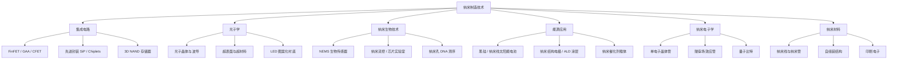

# 第十二章 应用前景与发展趋势

## 12.1 引言

纳米制造技术并非孤立存在。在实际应用中，任何单一制造技术都难以独立完成功能器件的构建，通常需要将多种技术组合使用，各取所长 （参见：Cui 2025, Ch.11）。应用与制造技术之间存在深刻的相互依存关系：应用需求是拉动制造技术进步的市场力量（market pull），而制造技术的突破则推动设计者构想新型应用（technology push）（参见：Cui 2025, Ch.11）。

本章将系统介绍纳米制造技术在以下关键领域的应用现状与发展趋势：半导体集成电路、光子学器件、纳米生物技术、能源应用、纳米电子学新范式，以及自组装等新兴制造方法。

---

## 12.2 半导体集成电路制造

### 12.2.1 从平面到三维：晶体管架构演进

摩尔定律（Moore's Law）自 1965 年提出以来，预测芯片上晶体管数量大约每两年翻一番 （参见：Cui 2025, Ch.11）。近 60 年来，这一规律基本得到验证，尽管倍增周期已从 24 个月延长至约 33 个月 （参见：Cui 2025, Ch.11）。

晶体管架构经历了根本性变革：

| 架构类型 | 英文名称 | 引入节点 | 结构特征 | 栅极控制 |
|---------|---------|---------|---------|---------|
| 平面场效应管 | Planar FET | 传统 | 二维平面结构 | 单面控制沟道 |
| 鳍式场效应管 | FinFET | 22 nm | 2.5 维鳍状结构 | 三面环绕沟道 |
| 全环绕栅极管 | GAA FET | ~5 nm | 三维纳米片结构 | 四面环绕沟道 |
| 互补场效应管 | CFET | 未来 | 垂直堆叠 pFET/nFET | 最大化沟道宽度 |

自 22 nm 技术节点起，所有集成电路晶体管均采用 FinFET 结构。FinFET 的栅极从三个方向包围沟道，即使沟道进一步缩窄也能保持有效的电流控制 （参见：Cui 2025, Ch.11）。继续缩小至 7 nm 以下节点时，FinFET 效率不足，必须采用全环绕栅极晶体管（GAA FET），栅极从四个方向包围沟道 （参见：Cui 2025, Ch.11）。

<strong>关键概念：技术节点的真实含义</strong> 
需要注意的是，22 nm 节点之后，"技术节点"名称不再对应晶体管的任何可测量物理尺寸。例如，三星的"5 nm"节点实际最小金属间距为 36 nm，对应 18 nm 半间距。半导体行业仍沿用递减的节点命名，但这些数字不再具有原始的物理含义 （参见：Cui 2025, Ch.11）。

### 12.2.2 未来架构：CFET 与三维堆叠

下一代集成电路的核心发展方向是将 P 型和 N 型晶体管垂直堆叠，即互补场效应管（Complementary FET, CFET）。传统 CMOS 中 pFET 和 nFET 并排放置，进一步缩小需要减小沟道宽度从而降低性能。CFET 通过垂直堆叠，在不牺牲芯片面积的情况下最大化有效沟道宽度 （参见：Cui 2025, Ch.11）。

CFET 的制造方案有两种路径：

- **单片式（monolithic）**：先外延生长底层沟道，沉积中间牺牲层，再外延生长顶层沟道。挑战在于高纵横比垂直结构的制造，以及顶层掺杂退火温度（~900°C）可能损伤底层器件
- **顺序式（sequential）**：将预掺杂的单晶晶圆键合到已加工的底层晶圆上，再进行顶层器件制造。关键限制是顶层工艺的热预算需控制在 500°C 以下 （参见：Cui 2025, Ch.11）

根据 IRDS 2022 路线图预测，从 2028 年 1.5 nm 节点起，将采用双层晶体管堆叠（T2），到 2037 年可能达到六层堆叠（T6）（参见：Cui 2025, Ch.11）。

### 12.2.3 光刻技术路线图

集成电路制造的核心挑战始终在光刻（lithography）技术。根据 IRDS 2022 路线图 （参见：Cui 2025, Ch.11）：

| 时间节点 | 逻辑节点 | 最小半间距 | 主要光刻方案 |
|---------|---------|-----------|------------|
| 2022 | 3 nm | 12 nm | EUV 0.33 NA 多重图案化 |
| 2025 | 2.1 nm | 10 nm | EUV 0.33 NA 多重 / 0.55 NA 单次 |
| 2028 | 1.5 nm | 8 nm | EUV 0.55 NA 单次曝光 |
| 2031+ | 1.0 nm | 8 nm | 高 NA EUV 多重 / 超越 EUV |

低成本替代方案包括 EUV 结合定向自组装（Directed Self-Assembly, DSA），利用嵌段共聚物形成更小半间距的图案 （参见：Cui 2025, Ch.11）。

### 12.2.4 超越摩尔：异质集成

除传统的"更多摩尔"（More Moore）路径外，半导体行业自 2009 年起推进"超越摩尔"（More than Moore）方向，将多种功能集成在一起 （参见：Cui 2025, Ch.11）：

- **系统级芯片（SoC, System on Chip）**：将 CPU、存储器、MEMS 传感器等不同功能电路集成在单个芯片上
- **系统级封装（SiP, System in Package）**：将不同功能的裸片堆叠或并排放置在单个封装中，通过硅通孔（Through Silicon Via, TSV）或键合线互连
- **芯粒技术（Chiplets）**：将 SoC 分解为独立功能模块（芯粒），通过先进封装（如台积电 CoWoS 技术）组装为完整系统 （参见：Cui 2025, Ch.11）

IC 制造涉及的核心纳米制造工艺包括：薄膜沉积、光刻图案化、掺杂（离子注入与扩散）、刻蚀，以及多层互连制造。现代先进芯片需要经历 20-30 次光刻与刻蚀/沉积循环 （参见：Cui 2025, Ch.11）。

---

## 12.3 光子学器件

### 12.3.1 光子晶体与波导

光子学（photonics）是光的科学与技术，涵盖光的产生、导引、调控、放大和探测 （参见：Cui 2025, Ch.11）。全球光使能系统市场预计到 2025 年将接近 2 万亿美元 （参见：Cui 2025, Ch.11）。

光子晶体（photonic crystal）是最基本的光子器件之一，可分为一维、二维和三维结构。当一种材料周期性地嵌入另一种不同折射率的材料中时，特定能量的光波将被完全阻挡，形成光子带隙（photonic bandgap）。这与半导体晶体中周期性原子排列形成电子能带的原理类似 （参见：Cui 2025, Ch.11）。

光子晶体的实际应用需要引入设计缺陷——即没有周期性结构的区域——以引导光波沿特定路径传播，形成波导。可用于制造光子晶体的纳米制造技术包括：

- 传统自上而下（top-down）光刻与图案转移
- 自下而上（bottom-up）胶体粒子与纳米球自组装
- 嵌段共聚物自组装
- 紫外干涉光刻与电子束光刻的组合 （参见：Cui 2025, Ch.11）

### 12.3.2 超表面与微光学元件

超材料（metamaterials）是人工工程材料，具有自然界不存在的负折射率特性。经典构型为金属开口环谐振器（Split Ring Resonator, SRR），制造过程相对简单：光刻图案化加金属剥离（liftoff）。对于小尺寸 SRR，可使用电子束光刻 （参见：Cui 2025, Ch.11）。

超表面（metasurface）是超材料概念的演进——薄型二维超材料层，通过纳米结构天线散射光波来操控电磁波传播。其优势包括低成本、低吸收损耗和易于集成。超表面是替代体光学元件的最有前途的候选方案之一，例如虚拟现实（VR）头显中的光学透镜 （参见：Cui 2025, Ch.11）。大规模制造方案包括卷对卷纳米压印和纳米球光刻 （参见：Cui 2025, Ch.11）。

### 12.3.3 纳米压印光刻在光子学中的机遇

纳米压印光刻（Nanoimprint Lithography, NIL）虽然在集成电路主流制造中未能取代光学光刻，但在光子学领域找到了巨大的产业化机遇。光子器件使用的层数远少于传统 IC，而 NIL 擅长在刚性或柔性衬底上制造单层高分辨率周期性纳米结构。NIL 为亚 100 nm 亚波长光子器件（如光子晶体、波导、光栅耦合器）提供了经济高效的制造方案 （参见：Cui 2025, Ch.6）。

图案化蓝宝石衬底（Patterned Sapphire Substrate, PSS）是 NIL 的典型应用之一：通过在 LED 蓝宝石衬底表面制造规则图案，打断全反射，可将光提取效率提高 20%-60% （参见：Cui 2025, Ch.11）。

---

## 12.4 MEMS 与 NEMS

微机电系统（Microelectromechanical Systems, MEMS）是非电子纳米制造应用的重要领域。传统 MEMS 器件分为传感器（将物理量转化为电信号）和执行器（将电能转化为受控运动）（参见：Campbell 2008, Ch.19）。

MEMS 传感器包括：压力传感器、加速度计（安全气囊触发器件）、化学传感器等。MEMS 执行器包括：视频投影仪中的微镜阵列、喷墨打印头、微流控系统等 （参见：Campbell 2008, Ch.19）。

MEMS 制造与标准 IC 制造使用相同的加工工具，但关注点不同：IC 制造注重阈值电压控制、器件隔离和亚微米栅极形成，而 MEMS 关注薄膜应力、深硅刻蚀和释放结构 （参见：Campbell 2008, Ch.19）。

纳米机电系统（Nanoelectromechanical Systems, NEMS）是 MEMS 的纳米尺度延伸。NEMS 的核心元件是自由悬挂的纳米级薄梁——桥式（两端固定）或悬臂式（一端固定）结构，可被电驱动进入振动模式，因此称为纳米谐振器（nanoresonator）（参见：Cui 2025, Ch.11）。

<strong>案例：纳米谐振器生物传感器</strong> 
纳米谐振器的主要应用是高灵敏度生物传感。在高谐振频率下，谐振器上微量质量变化即可改变其谐振频率并被检测。已报道的检测灵敏度：悬臂式纳米谐振器可检测低至 10-18 g（阿克级）的质量变化，相当于单个 DNA 分子；桥式纳米谐振器质量分辨率可达约 10-21 g（仄克级）（参见：Cui 2025, Ch.11）。

---

## 12.5 纳米生物技术

纳米生物技术（nanobiotechnology）将纳米技术工具应用于生物现象研究。纳米制造在其中扮演关键角色，通过多种方式创造纳米级结构以推进生物技术发展 （参见：Cui 2025, Ch.11）。

### 12.5.1 纳米流控系统

微流控（microfluidics）技术始于 40 多年前在硅晶圆上制造的第一个微型气相色谱仪，开创了"芯片实验室"（lab-on-a-chip）时代 （参见：Cui 2025, Ch.11）。纳米流控（nanofluidics）是其纳米尺度的延伸，关键结构包括纳米孔（nanopore）、纳米通道（nanochannel）和纳米移液管（nanopipet），均依赖先进纳米制造技术 （参见：Cui 2025, Ch.11）。

制造纳米流控系统的技术包括：

- 电子束光刻（EBL）图案化
- 聚焦离子束（FIB）铣削
- 刻蚀与沉积组合工艺
- 原子层沉积（ALD）自封闭技术：利用 ALD 的保形沉积特性，逐渐缩小沟槽开口并封闭，同时将内部通道缩窄至亚 10 nm 尺度 （参见：Cui 2025, Ch.11）

纳米孔在 DNA 测序中发挥了重要作用。电子束或离子束雕刻可将初始数十纳米的孔径缩小至约 1 nm （参见：Cui 2025, Ch.11）。

### 12.5.2 应用领域拓展

纳米光刻技术已渗透到更广泛的生物与医学领域。De Teresa 总结了纳米光刻的应用范围，除经典的纳米电子学外，还包括磁性材料纳米图案化、纳米超导体、纳米磁学、电学纳米接触、纳米传感器、能量存储与转换，以及生物学、医学、机器人学和神经科学等新兴领域 （参见：De Teresa 2020）。

---

## 12.6 纳米电子学新范式

### 12.6.1 量子效应器件

传统硅基 CMOS 集成电路终将面临物理、拓扑或技术极限。研究者持续探索基于量子力学原理的新型器件 （参见：Cui 2025, Ch.11）：

**单电子晶体管（Single-Electron Transistor）**：利用量子限域效应，电子运动不再连续而是以单个电子量子化传输（库仑阻塞效应）。通常该效应仅在极低温（~5 K）下显著，但通过制造亚 5 nm 的超小硅岛，可实现室温（300 K）工作 （参见：Cui 2025, Ch.11）。

**隧穿场效应管（Tunnel FET, TFET）**：通过调制源-漏势垒的量子隧穿（而非传统 MOSFET 的热电子发射）来控制电流。TFET 可实现低于 60 mV/dec 的亚阈值摆幅，带来更低功耗和更高工作速度 （参见：Cui 2025, Ch.11）。TFET 的成功关键在于高迁移率、低带隙的沟道材料。自 2004 年发现石墨烯以来，大量二维半导体材料为高性能 TFET 提供了新的可能，尽管目前实验性能仍落后于理论预测 （参见：Cui 2025, Ch.11）。

### 12.6.2 扫描探针制造的原子级器件

扫描探针光刻（Scanning Probe Lithography）可用于制造原子级精度的纳米器件，包括单电子晶体管、量子计算量子比特（qubit）、可编辑原子级存储器，以及二维量子超材料 （参见：Cui 2025, Ch.5）。

---

## 12.7 纳米材料与制造

### 12.7.1 自上而下与自下而上

纳米材料——包括零维量子点与纳米粒子、一维碳纳米管与纳米线、二维石墨烯——可通过自上而下或自下而上两种途径制造 （参见：Cui 2025, Ch.11）：

- **自上而下**：通过光刻图案化和刻蚀/氧化工艺，从 SOI 衬底制造硅纳米线，用于场效应管和传感器
- **自下而上**：利用金催化剂通过气-液-固（VLS）工艺生长垂直硅纳米线；以镍为催化剂通过 PECVD 在精确位置生长碳纳米管（CNT）（参见：Cui 2025, Ch.11）

### 12.7.2 自组装纳米制造

自组装（self-assembly）本质上具有两大优势：一是能在真正的纳米尺度（分子级或 10 nm 以下）构建结构；二是成本低廉，因为不需要复杂昂贵的制造设备 （参见：Cui 2025, Ch.10）。

自组装纳米制造的关键形式包括：

- **自组装单分子层（SAM, Self-Assembled Monolayer）**：烷基硫醇在 Au(111) 表面自发吸附形成有序分子组装体，已广泛应用于纳米图案化 （参见：Cui 2025, Ch.10）
- **嵌段共聚物定向自组装（DSA）**：已被列入 IRDS 路线图作为 EUV 光刻的低成本替代方案 （参见：Cui 2025, Ch.11）
- **胶体粒子可控聚集**：用于形成功能性图案与结构

当前自组装技术仍处于较原始阶段，大多数自组装纳米结构为阵列型。多数情况下，自组装需要在模板上引导进行，即"自上而下与自下而上的结合"（top-down meets bottom-up），这将是自组装纳米制造的主要发展方向 （参见：Cui 2025, Ch.10）。

---

## 12.8 纳米光子学

不同于宏观光子学关注与光波长相当的结构尺度上的光-物质相互作用，纳米光子学（nanophotonics）研究远低于光波长尺度上的光传播行为。利用精密加工的金属和介电纳米结构，光可以被散射、折射、限域、滤波和处理，实现传统材料和几何构型无法达到的效果 （参见：Cui 2025, Ch.11）。

**等离激元领结天线（Plasmonic Bow-Tie Antenna）** 是纳米光子学与纳米制造紧密结合的典型案例。当偏振激光照射领结天线间隙时，激发金属三角形顶点处的等离激元共振，共振强度可达入射光的数百至数万倍。间隙越窄共振越强——3 nm 间隙的增强因子比 50 nm 间隙高一个数量级 （参见：Cui 2025, Ch.11）。制造如此窄的金属间隙可使用直接电子束光刻、聚焦离子束铣削或纳米压印等技术。正如文献所言，纳米制造是"推动纳米光子学进步的无名英雄" （参见：Cui 2025, Ch.11）。

---

## 12.9 能源应用

纳米制造技术在能源领域的应用日益重要，涵盖太阳能电池、电池储能和燃料电池催化等方向。纳米尺度的结构工程能够显著提升器件的能量转换与存储效率。

### 12.9.1 太阳能电池

**黑硅（black silicon）** 是纳米制造技术在光伏领域的经典应用。通过金属辅助化学刻蚀（Metal-Assisted Chemical Etching, MACE）或反应离子刻蚀（RIE）在硅表面形成纳米级绒面结构，可将宽光谱范围内的反射率降低至 1% 以下，大幅提高光吸收效率 （参见：Cui 2025, Ch.7；Cui 2025, Ch.11）。MACE 工艺利用贵金属（如 Ag、Au）纳米颗粒作为催化剂，在 HF/H₂O₂ 溶液中选择性刻蚀硅，形成高密度纳米柱或纳米孔阵列 （参见：Cui 2025, Ch.7）。

纳米线太阳能电池（nanowire solar cell）利用垂直纳米线阵列实现光捕获增强：纳米线作为亚波长光学天线，能将光有效耦合进入有源层，降低对材料厚度的要求。纳米压印光刻（NIL）可用于制造减反射涂层（anti-reflection coating）的亚波长周期性纳米结构，以低成本替代传统多层镀膜工艺 （参见：Cui 2025, Ch.6）。

### 12.9.2 电池与储能

纳米结构化电极（nanostructured electrode）通过增大电极-电解质界面面积来提高锂离子电池的功率密度与循环寿命。纳米孔、纳米线和纳米管形貌的电极可缩短离子扩散路径，同时缓解充放电过程中的体积膨胀应力（参见：Cui 2025, Ch.11）。

原子层沉积（Atomic Layer Deposition, ALD）在电池技术中发挥关键作用：在电极颗粒表面沉积超薄（1-5 nm）氧化物保护层（如 Al₂O₃、TiO₂），可抑制副反应、稳定固体电解质界面（SEI），从而显著改善循环稳定性（参见：Cui 2025, Ch.8）。ALD 的保形沉积特性使其能均匀覆盖高比表面积的复杂三维电极结构 （参见：Cui 2025, Ch.8）。固态电池（solid-state battery）中，ALD 同样可用于优化电极与固态电解质之间的界面，降低界面阻抗（参见：Cui 2025, Ch.8）。

### 12.9.3 燃料电池与催化

燃料电池（fuel cell）的性能在很大程度上取决于催化剂的有效面积。通过纳米图案化技术制造高比表面积的催化剂载体（catalyst support），可在降低贵金属（如铂）用量的同时提高催化活性。纳米制造的核心贡献在于精确控制催化剂纳米颗粒的尺寸、间距和分布，最大化表面积-体积比（surface-to-volume ratio），从而提升电化学反应速率 （参见：Cui 2025, Ch.11）。

<strong>能源纳米制造的技术交叉</strong> 
能源应用体现了纳米制造技术的高度交叉性：黑硅制造综合运用了湿法刻蚀与干法刻蚀（第七章）；电极改性依赖 ALD 薄膜沉积（第八章）；减反射结构利用纳米压印光刻（第六章）。这些应用展示了"工具箱式"组合制造策略的重要性。

---

## 12.10 纳米制造技术应用比较

### 应用领域技术对照表

| 应用领域 | 关键纳米制造技术 | 典型特征尺度 | 发展阶段 |
|---------|----------------|------------|---------|
| 先进逻辑芯片 | EUV 光刻 + 多重图案化 + 刻蚀 | 8-12 nm 半间距 | 量产 |
| 3D NAND 存储器 | 高纵横比刻蚀 + ALD | 232+ 层堆叠 | 量产 |
| 光子晶体 | EBL / NIL / 干涉光刻 | 亚微米周期 | 量产/研发 |
| 超表面 | EBL / NIL / 纳米球光刻 | 亚波长结构 | 研发/小批量 |
| LED 图案化衬底 | NIL / 光刻 + 刻蚀 | 数百 nm | 量产 |
| MEMS 传感器 | 体硅深刻蚀（Bosch 工艺） | 微米级 | 量产 |
| NEMS 谐振器 | EBL + 释放刻蚀 | 纳米级悬梁 | 研发 |
| 纳米流控 | EBL / FIB / ALD 自封闭 | 亚 10 nm 通道 | 研发 |
| 纳米孔测序 | FIB / 电子束雕刻 | ~1 nm 孔径 | 产品化 |
| 黑硅太阳能电池 | MACE / RIE 纳米绒面 | 纳米级表面结构 | 量产 |
| 电池电极改性 | ALD 保护涂层 | 1-5 nm 薄膜 | 研发/量产 |
| 燃料电池催化 | 纳米图案化催化剂载体 | 纳米颗粒分布 | 研发 |
| 单电子晶体管 | EBL 超精细图案化 | 亚 5 nm 硅岛 | 研究 |
| 等离激元器件 | EBL / FIB 铣削 | 1-10 nm 间隙 | 研发 |
| 定向自组装 | 嵌段共聚物 + 模板 | 亚 10 nm | 预量产研发 |

---

## 12.11 未来展望

### 12.11.1 制造技术的持续演进

纳米制造技术的发展方向可从以下几个维度理解：

**分辨率极限的突破**：集成电路制造的最小半间距将在未来 15 年内保持在 8 nm 左右。制造挑战更多转向三维架构和异质集成，而非简单的尺寸缩小 （参见：Cui 2025, Ch.11）。高纵横比刻蚀（如深反应离子刻蚀 DRIE）和原子层沉积/刻蚀（ALD/ALE）技术将在三维器件制造中发挥越来越重要的作用。

**成本与产能的优化**：NIL 在光子学和 LED 制造中的成功证明，不同应用领域需要不同的最优制造策略。光刻技术并非越先进越好，而是需要与应用需求匹配 （参见：Cui 2025, Ch.6）。

**自上而下与自下而上的融合**：定向自组装已被列入半导体路线图作为 EUV 光刻的补充方案。未来的纳米制造将更多采用传统光刻与自组装相结合的混合策略 （参见：Cui 2025, Ch.10）。

### 12.11.2 新兴应用的驱动

全球纳米技术市场在 2022 年估值 570 亿美元，预计到 2028 年将达到 1830 亿美元 （参见：Cui 2025, Ch.11）。驱动这一增长的关键应用领域包括：

- 先进集成电路的持续缩放与三维集成
- 光子学器件在通信、显示、传感中的广泛部署
- 纳米流控与纳米孔技术在精准医疗中的应用
- 纳米制造驱动的高效太阳能电池、高性能电池和低铂燃料电池
- 柔性电子与印刷电子技术利用纳米材料墨水实现产业化
- 量子器件从实验室走向实用化

<strong>技术选择的思考框架</strong> 
选择纳米制造技术时需综合考虑：(1) 所需的最小特征尺寸；(2) 图案复杂度与层数；(3) 产能与成本要求；(4) 与现有工艺基础设施的兼容性。没有单一技术能满足所有应用——技术选择的本质是在分辨率、产能、成本和工艺兼容性之间寻找最优平衡 （参见：Cui 2025, Ch.11）。

---

<strong>本章小结</strong>

1. 集成电路晶体管架构已从平面 FET 演进至 FinFET（22 nm 起）、GAA FET（~5 nm）和未来的 CFET。摩尔定律的延续依赖三维堆叠而非简单尺寸缩小 （参见：Cui 2025, Ch.11）。

2. EUV 光刻是未来 15 年 IC 制造的主要光刻方案，最小半间距将稳定在约 8 nm。定向自组装（DSA）可作为低成本补充方案 （参见：Cui 2025, Ch.11）。

3. 光子学是纳米制造技术（特别是 NIL）实现大规模产业化应用的重要领域，涵盖光子晶体、超表面、LED 图案化衬底等方向 （参见：Cui 2025, Ch.11）。

4. NEMS 纳米谐振器可实现阿克至仄克级的质量检测灵敏度，为单分子生物传感提供了平台。纳米流控系统支撑了纳米孔 DNA 测序等精准医疗技术 （参见：Cui 2025, Ch.11）。

5. 能源应用是纳米制造的重要增长领域：黑硅纳米绒面（MACE/RIE）大幅降低太阳能电池反射率；ALD 超薄涂层改善电池电极循环稳定性；纳米图案化催化剂载体提升燃料电池效率 （参见：Cui 2025, Ch.7；Cui 2025, Ch.8；Cui 2025, Ch.11）。

6. 量子效应器件（单电子晶体管、TFET）和二维材料器件代表了超越传统 CMOS 的新范式，但目前实验性能仍落后于理论预测 （参见：Cui 2025, Ch.11）。

7. 自组装与传统自上而下制造的结合是纳米制造的重要发展方向，兼具纳米级分辨率和低成本优势 （参见：Cui 2025, Ch.10）。

8. 纳米制造技术的选择本质上是分辨率、产能、成本和工艺兼容性之间的权衡，不同应用领域需要不同的最优制造策略。

